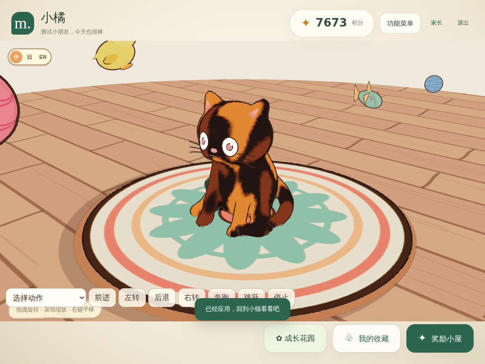
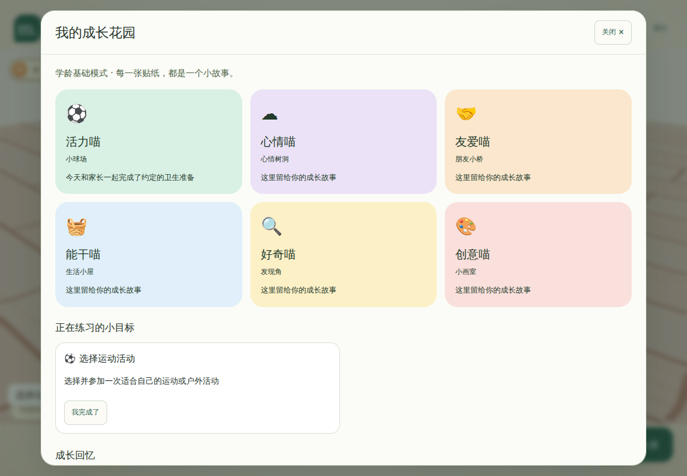
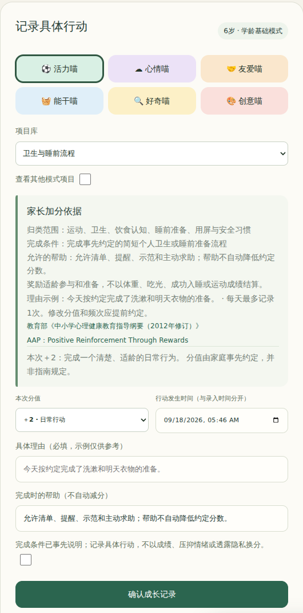
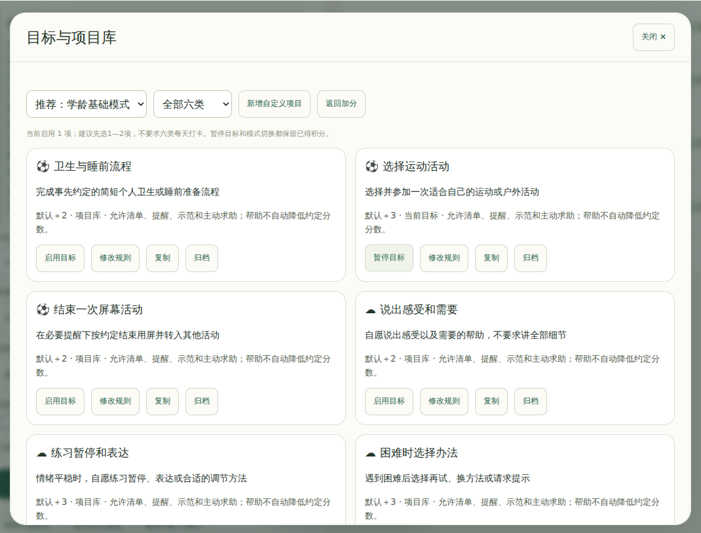
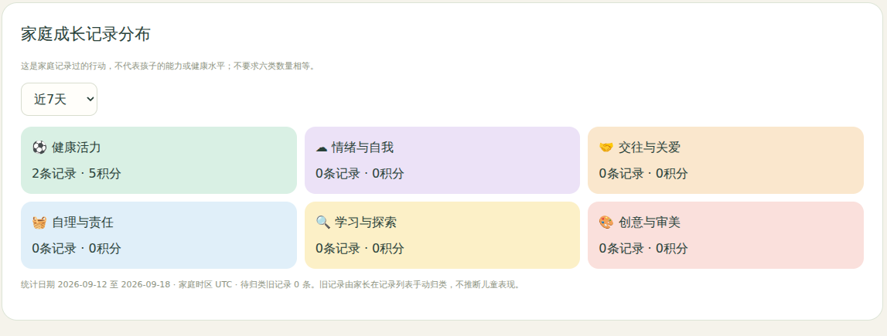
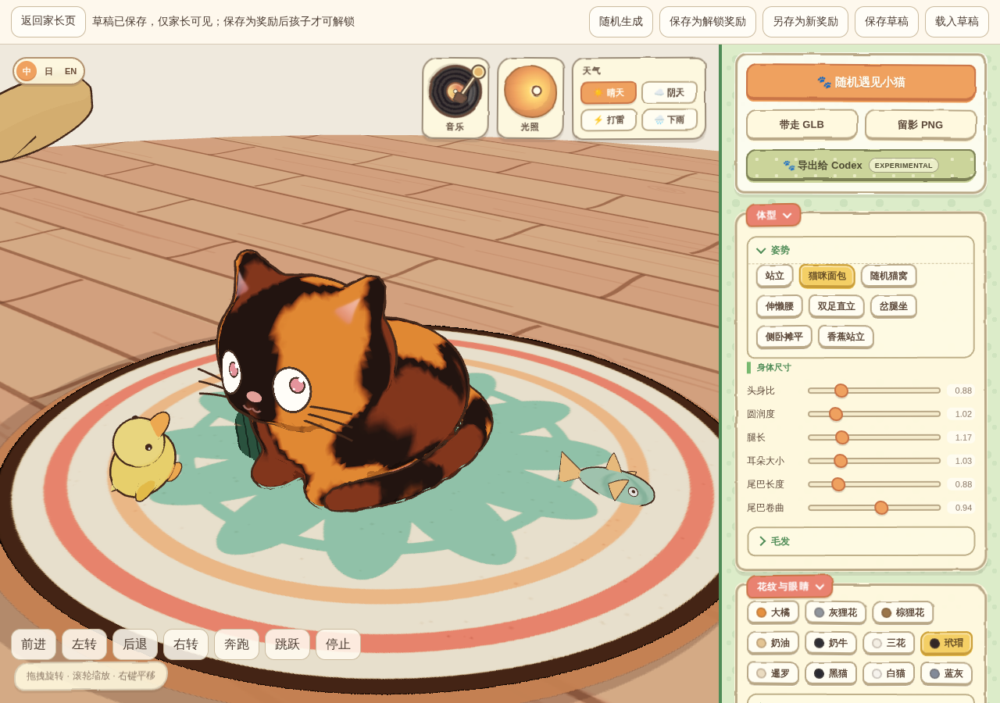

<div align="center">

# Meow · 小猫成长花园

一个把现实中的小小努力，变成成长回忆、小猫装扮和房间礼物的自托管家庭应用。

**3—10岁 · 三种成长模式 · 六类成长记录 · 家长确认加分 · 服务端账本 · 本机合影**

[本地运行](#本地运行) · [家长加分指南](pet/GROWTH_GUIDE.md) · [接口文档](pet/GROWTH_API.md) · [反馈问题](https://github.com/cy677/Meow/issues)

[非商业源码开放授权](LICENSE) · [商业使用与合作](COMMERCIAL-LICENSE.md) · [原版项目](https://github.com/ringhyacinth/Meow-Generator)

</div>



<p align="center"><sub>儿童首页直接与小猫互动；装扮和房间内容来自已拥有的奖励。本文配图为实际程序截图，使用临时演示账户，积分与昵称不代表真实家庭数据。</sub></p>

## 关于 Meow

**Meow · 小猫成长花园**是在 **Meow Generator** 基础上改造的家庭积分宠物。原版由 **Simon_阿文（Simon Lee）** 与 **海辛（Ring Hyacinth）** 共同创作，提供程序化小猫、软体触摸、骨骼动作、物理玩具、天气和收藏卡片；本分支增加适龄目标、家长加分依据、成长记录与奖励管理。

孩子在现实生活中完成事先约定的小行动，家长记录具体理由并确认积分。喵币用于兑换小猫外观、猫窝、木地板、玩具及家长保存的完整作品。小猫保持正常互动，不因没有积分、没有登录或未完成任务而挨饿、生病或离开。

**家庭版有账户和 Node.js 服务，业务数据保存在运行该服务的电脑或服务器上的 SQLite 数据库中，不在 iPad 浏览器里。** 家庭电脑部署时数据在家庭电脑；公网服务器部署时数据在该服务器。积分、加分理由、奖励预设和兑换记录通过当前服务读写，不自动同步到 GitHub 或其他第三方平台。原版静态生成器的“无后端、无需登录”说明不适用于家庭积分服务。

摄像头画面和合影照片另外处理：只在当前 iPad 浏览器内存中合成、预览，由用户通过系统菜单或长按图片存入“照片”。Meow 不上传照片、不建立网页相册，也不把照片写入 SQLite、IndexedDB 或 localStorage。

## 主要功能

新增 **14项模型礼物**：小鸡、小兔、蜜蜂、毛毛虫，三种玩具车、真实碰撞坡道、两盒积木，以及矮凳、边桌、低书架和可开关落地灯。进入儿童端“礼物与收藏 → 模型礼物”兑换、装备；家长在奖励预设表中修改价格和门槛。模型与纹理本地发布，原积分、收藏和房间保持不变。[操作、交互范围与维护说明](pet/MODEL_REWARDS.md)。

- **互动小猫与房间**：21个基础动作默认可用，新增招爪问好、礼貌鞠躬、歪头卖萌和欢乐庆祝奖励；小猫会靠近玩具并在够得到时抬爪推动。保留软体触摸、物理玩具、光照、天气、拍照和导出。[动作规则](pet/MOTION.md)。
- **适龄成长目标**：家长初始化填写年龄，确认学前、学龄基础或学龄进阶模式；内置66个项目，支持自定义和分步任务。
- **有依据的家长加分**：每项展示完成条件、允许的帮助、默认分值、理由示例及参考资料；真实理由必填，孩子提交需家长确认。
- **成长花园与回忆**：六个并列分类、3×2卡片、分页记录与近期分布，不给孩子的能力或心理健康排名。
- **奖励与服务端数据管理**：喵币与累计经验分开；家长保存固定外观和场景作品；支持旧数据迁移、记录查询、JSON导出及数据库备份。

## 三种成长模式

首次使用时，家长填写孩子的周岁并确认模式。**6岁可结合是否入学选择，年龄仅用于推荐，不锁定模式。**

| 模式 | 参考阶段 | 默认项目与参与方式 |
| --- | --- | --- |
| **学前模式** | 3—6岁，主要面向尚未入学的儿童 | 30个预设；生活与游戏中一次一个小步骤，允许示范和共同完成，主要由家长记录 |
| **学龄基础模式** | 6—8岁参考 | 18个预设；简短流程、学习准备、同伴合作和家庭责任，孩子可以提交完成情况 |
| **学龄进阶模式** | 9—10岁参考 | 18个预设；目标选择、任务拆分、检查与协商，支持多日小项目和分步记录 |

修改年龄不会自动切换模式。切换模式只更新推荐和展示方式，**不清空积分、记录和收藏，不自动替换已启用目标或进行中的项目**。家长仍可选用其他模式中合适的项目。

初始化不强制启用目标。建议先选1—2个正在练习的小目标，进阶模式可选2—3个；66个预设是项目库，不是每日必须完成的任务表。

## 六类成长花园



<p align="center"><sub>六类并列、不分高低。点开卡片查看具体行动和回忆，没有记录的分类不会变灰或枯萎。</sub></p>

| 主分类 | 儿童名称 | 归类范围 |
| --- | --- | --- |
| **健康活力** | ⚽ 活力喵 | 运动、卫生、饮食认知、睡前准备、安全和用屏习惯 |
| **情绪与自我** | ☁️ 心情喵 | 自愿表达感受、求助、调节方法、自我认识与挫折应对 |
| **交往与关爱** | 🤝 友爱喵 | 倾听、合作、关爱、协商和个人边界 |
| **自理与责任** | 🧺 能干喵 | 自理、整理、家务、履行约定与失误补救 |
| **学习与探索** | 🔍 好奇喵 | 阅读、观察、提问、学习方法、尝试和检查 |
| **创意与审美** | 🎨 创意喵 | 绘画、音乐、手工、故事、想象游戏和欣赏 |

按照本次主要鼓励的行动选择一个主类别，同一行动只奖励一次。例如，搭积木时鼓励合作归“友爱喵”，鼓励研究怎样搭得稳归“好奇喵”，鼓励设计造型归“创意喵”。

## 家长加分依据

在家长页的 **“日常加分”** 中选择分类和项目，系统会展示**完成条件、允许的帮助、默认分值、计分频次、理由示例、不宜计分的情形，以及参考资料与适用范围**。

<p align="center">
  <a href="docs/readme/parent-scoring.png"></a>
</p>

<p align="center"><sub>家长加分页局部截图。示例只作提示，不会自动当作已经发生的行为；家长填写真实理由并确认后入账。</sub></p>

| 分值 | 名称 | 加分依据 |
| --- | --- | --- |
| **＋1** | 小步尝试 | 事先约定只尝试一个很小的步骤 |
| **＋2** | 日常行动 | 完成一个清楚、适龄的日常行为；自定义项目默认值 |
| **＋3** | 投入练习 | 完成一段活动，或尝试解决一个问题 |
| **＋5** | 特别进步 | 相对孩子自身起点的明显进步，或事先约定的小挑战 |
| **0** | 仅记录 | 留下成长回忆，不增加喵币与经验 |

改变默认分值时，需要填写事先约定的依据。**成人提醒、清单、示范、共同完成或主动求助不自动减分。** 加分理由应描述具体行动，例如“今天整理书包时，你照着清单检查了水杯和作业本”，而不只是“今天很乖”。

不以成绩排名、吃光饭菜、立刻睡着、保持开心、不哭、服从或公开隐私作为默认奖励条件。安慰、安全、基本照护和亲子陪伴不需要积分兑换。

完整项目表、操作示例与参考来源见 **[家长加分指南](pet/GROWTH_GUIDE.md)**，也可在家长页面离线查看；打开参考原文链接需要联网。六类、模式和分值是产品配置，不是指南规定的评分表、发育达标线或心理筛查，不代表相关机构认可本产品。

## 目标、记录和确认



<p align="center"><sub>项目库与当前目标分开。家长选择少量目标，用普通表单修改规则，不需要编辑JSON。</sub></p>

家长在 **“日常加分 → 目标与项目库”** 启用、暂停或归档项目。未启用项目不显示失败或缺勤，也可以单独记录自然发生的小行动。

普通项目默认每天最多计分一次，可事先配置1—4次，或设为只记录一次。家庭时区决定计分日期，行为时间与录入时间分别保存。**计分频次不是刷牙、运动等实际行为的健康推荐频次。**

学龄孩子点击 **“我完成了”** 后，只产生待确认记录，不直接增加积分。说明可留空，不要求提交照片或隐私。家长核对并确认后入账；提交时的规则快照会保留，后续修改项目或切换模式不改变已提交的约定。

多日项目最多设置12个步骤，按步骤分别计分，不再重复领取项目总分。暂停时保留已完成步骤；已有记录的项目需要改变步骤时，应复制为新项目。

### 看见成长，不做能力排名



记录支持按类型、理由文字和六类筛选，并用游标翻页查看完整历史。儿童端每页显示5条回忆；家长可以查看近7天或近30天的记录分布。

**图表只表示家庭记录了哪些行动，不代表孩子的能力或健康水平。** 六类数量不要求相等；没有记录可能只是没有登记，不应被解释为孩子存在某方面的不足。

## 小猫奖励与家长创作



<p align="center"><sub>家长可以随机生成后继续调整，并保存为固定作品。预览和私有草稿不改变孩子当前的小猫。</sub></p>

**喵币余额**用于兑换，购买后减少；**累计成长经验**不因兑换减少；**六类成长记录**保留具体行动和当时的规则。默认每加1分，同时获得1枚喵币和1点成长经验。

内置2枚喵币、无经验门槛的“薄荷小眼睛”，让一个普通小目标即可兑换小礼物。原有奖励ID、家长自定义价格、解锁门槛和所有权不会被批量重置。

在 **“奖励预设 → 生成奖励 / 参数面板”** 中，家长可以调整花色、体型、眼睛、姿态、木地板、垫子及其他原版参数，保存为完整作品。兑换价格与累计经验门槛分别设置；孩子兑换并使用后获得已保存的固定结果，不会重新随机。

已兑换物品重复使用不再次收费。21个基础动作无需积分或兑换，家长也不能为它们设置门槛；新增特色动作与连续表演仍可设置奖励规则。抚摸、拍照及已有免费导出功能保持可用。参数编辑和随机生成仅供家长使用。

## 与小猫合影

在儿童页面点“拍照 · 留影”，再点“与我合影”。首次允许 Safari 使用摄像头，默认前置镜头，可切换前后镜头或关闭自拍镜像。单指拖动调整小猫在画面中的位置，双指张合调整大小，“还原构图”恢复本次默认视角。地板、天气等房间内容只在合影渲染时隐藏，不修改已拥有奖励或持久化装扮。

拍摄后先显示最终照片，并立即关闭摄像头。点“存储到 iPad 照片”，在系统菜单中选择“存储图像”；没有文件分享功能时可长按预览图片存储。系统菜单可以提供其他目标，网页不能强制选择某个目标，也无法读取系统相册确认是否保存。关闭预览后未保存的照片不保留。照片库自身的 iCloud 同步由设备设置控制，不是 Meow 上传。

家庭版普通小猫纪念卡也采用预览和系统保存，不自动下载到“文件”；原版独立静态生成器的场景 PNG 导出接口保留。预览与导出图片均已移除底部仓库链接栏，仓库的许可证和原作者说明不变。

摄像头需要浏览器信任的 HTTPS 和用户授权。公开可信 CA 签发、覆盖访问地址且有效的证书不需要在 iPad 上额外安装；自建 CA 才需要在受管理设备上安装并信任。服务器与同源 iframe 均须允许 `camera=(self)`，反向代理不能再注入 `camera=()`。麦克风仍然禁用。功能边界和验收说明见 [第一版合影说明](docs/photo-v1.md)。

## 本地运行

需要 **Node.js 22.16.0或兼容的更新版本**、npm和支持WebGL的浏览器。下载或克隆包含成长功能的版本后，在项目根目录执行；使用未合并的开发分支时，应先切换到对应分支。

```bash
npm ci --ignore-scripts
npm run pet:build
npm run pet:lan
```

终端会打印实际局域网地址，例如 `http://192.168.1.100:8792`。让iPad与电脑处于同一可信局域网，用浏览器打开该地址，电脑需要保持运行。首次安装依赖需要联网；构建后的家庭功能不依赖外部模型或云端服务。

### 首次设置

打开 `http://电脑IP:8792/parent.html`，使用终端显示的一次性初始化口令，设置家长密码、不同的孩子进入码、昵称、小猫名字、周岁和成长模式。初始化口令不应当作孩子进入码分享；不要求真实姓名或完整出生日期。

Windows用户完成构建后，也可使用根目录的 **`一键启动.cmd`**。该入口读取 `pet-settings.json`；已有端口或数据目录配置应保留，不要在更新时覆盖。

### 其他启动方式

```bash
npm run pet:start      # 只在本机使用
npm run pet:dev        # 积分应用开发服务
npm run pet:lan:https  # 配好受信任证书后使用
```

`npm run dev` / `npm run build` 仍对应原版静态编辑器，不是带SQLite的家庭积分服务。GitHub Pages只适合静态内容，不能代替本地家庭账本服务。

局域网HTTP不加密，不要把家长界面或服务端口直接暴露到公网。防火墙、HTTPS和陀螺仪配置见 **[平板部署说明](pet/PAD.md)**。家庭版以横屏iPad使用为主，系统权限与实际触摸表现仍需在真实设备上核查。

## 更新与数据保存

> **更新代码不等于重置数据。先停止服务，备份实际数据目录及修改过的 `pet-settings.json`，再覆盖程序文件。不要先删除整个旧项目，也不要运行 `清除数据.cmd` 来更新。**

默认数据文件为 `pet/data/pet.sqlite`。若设置过其他 `dataDir` 或 `MEOW_DATA_DIR`，应以启动窗口显示的实际数据库位置为准。保留整个数据目录，包括仍存在的SQLite附属文件，并保留自己使用的证书、私钥和本地配置。

首次打开旧库时，程序增量增加字段与成长表，不删除原流水、不推测年龄、不擅自分类、不重复发币，也不重定价已有奖励。旧用户在家长页补充年龄与模式，儿童仍可使用原有小猫和收藏。

旧加分由家长在 **“待归类旧记录”** 中核对并填写依据；归类不改变原时间、金额或余额。更新后提示补全年龄和模式是正常的；若要求重新创建家长密码和孩子进入码，应先检查是否打开了错误的数据目录。

误录更正必须关联原记录并说明原因，不是惩罚性扣分。原记录和审计保留；余额不足时拒绝更正，不透支或自动回收物品。累计经验和已解锁权益保留，被更正记录不计入成长分布。

家长页可导出完整JSON记录，不包含密码或会话。**JSON用于查阅，不提供自动导入恢复。** 恢复备份应先停止服务，再恢复完整SQLite数据目录。关闭网页或清理浏览器缓存不会删除运行服务的电脑或服务器上的数据库。

旧 `/api/parent/points` 仅保留作已有本地客户端兼容，新页面不调用它，也不提供任意负分输入。新成长接口执行分类、依据、分值、版本和频次校验。重复网络请求不会重复入账，但系统不能自动判断不同文字是否描述同一次现实行动，仍需家长避免重复登记。

## 操作方式

| 入口 | 操作 |
| --- | --- |
| **儿童首页** | 直接触摸小猫；使用动作选择、触屏方向键或键盘移动；通过功能菜单拍照和导出 |
| **成长花园** | 查看六类卡片和回忆；学龄模式可提交当前目标，等待家长确认 |
| **礼物与收藏** | 查看奖励条件、确认兑换、重复使用已拥有的装扮和作品 |
| **家长日常加分** | 选择项目、查看依据、填写真实理由并确认，也可仅记录不加分 |
| **家长奖励预设** | 调整价格和门槛，编辑或随机生成作品，保存草稿或另存为奖励 |

原版场景还保留相机旋转、缩放、平移、玩具抓取与投掷、脸颊软体互动和提起小猫。功能对应关系见 [原版功能对照](pet/UPSTREAM_PARITY.md)。

## 项目结构

| 路径 | 作用 |
| --- | --- |
| `pet/growthCatalog.mjs` | 三种模式、六类分类、66个项目及家长加分依据 |
| `pet/growthStore.mjs` | 年龄与目标、规则快照、日限、待确认、分类和更正 |
| `pet/growthUI.js` / `pet/growth.css` | 家长表单、儿童成长花园及记录分布 |
| `pet/store.mjs` / `pet/localLedger.mjs` / `pet/server.mjs` | SQLite账本、奖励、迁移、会话和本地接口 |
| `pet/tests/` | 成长规则、HTTP权限、场景生命周期和浏览器回归 |
| `pet/data/` / `pet-settings.json` | 默认运行数据目录与Windows启动配置，升级时保留 |
| `docs/readme/` | 本文实际界面截图及其来源说明 |
| `src/`、`public/`、`third_party/` | 原版小猫实现、素材、动作数据及第三方署名 |

详细资料：[家长加分指南](pet/GROWTH_GUIDE.md) · [成长接口说明](pet/GROWTH_API.md) · [家庭应用说明](pet/README.md) · [平板部署](pet/PAD.md)。

## 测试

```bash
npm run test:pet
npm run pet:build
npm run build
```

在独立测试环境安装浏览器测试工具，然后运行当前成长流程与原版首页回归：

```bash
npm install --no-save --package-lock=false --ignore-scripts playwright@1.55.0
npx playwright install chromium
node pet/tests/browser-maintenance.mjs
```

测试使用临时数据库，不包含家庭真实记录。原版动作、触摸、玩具拾取和阴影检查分别由 `test:motion`、`test:poke`、`test:fish-pick`、`test:toy-shadow` 提供。旧的独立小屋浏览器脚本保留作历史参考，部分旧选择器不适用于当前iframe首页。

本文截图来自已通过的浏览器回归；部分图片仅裁取相关界面，没有修改界面数值或生成演示UI。截图来源、提交与裁剪范围见 [配图说明](docs/readme/README.md)。浏览器回归通过不等于真实iPad Safari认证。

## 创作者、素材与授权

原版 **Meow Generator** 由 **Simon_阿文（Simon Lee）** 与 **海辛（Ring Hyacinth）** 共同制作。本分支的家庭积分功能建立在原版模型、交互、场景、音频和导出模块之上，README改写不移除原作署名。

**Required Notice: Copyright 2026 Simon_阿文 (Simon Lee) and Ring Hyacinth (海辛).**

`src/mesh2motionClips.json` 的精简动作数据及授权见 [Mesh2Motion素材说明](third_party/mesh2motion/README.md)。Three.js、Cannon-es、Vite及其他第三方内容保留各自许可证。

仓库沿用 [PolyForm Noncommercial License 1.0.0](LICENSE)，不是MIT或Apache许可。具体使用、修改与分发以许可证原文为准；商业使用与合作请阅读 [COMMERCIAL-LICENSE.md](COMMERCIAL-LICENSE.md)，并按原作说明联系取得相应授权。

## 当前状态

家庭成长功能、原版小猫互动和本地奖励管理已经接入。原版Motion、容器软体和Codex宠物导出仍保留实验性质，设备性能、极端参数及长时间WebGL运行表现可能不同。

第一版摄像头合影已经接入；本版尚未接入语音大模型或心理自动判断。家长功能与儿童权限在服务端分离；分类与分值用于家庭记录和鼓励，不用于心理筛查、诊断或儿童之间的比较。

欢迎提交可复现的问题与使用反馈。反馈时请勿公开家庭数据库、密码、初始化口令或孩子的私密记录。
