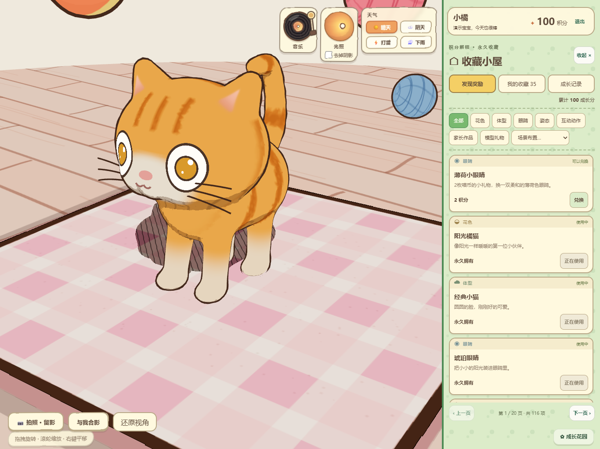
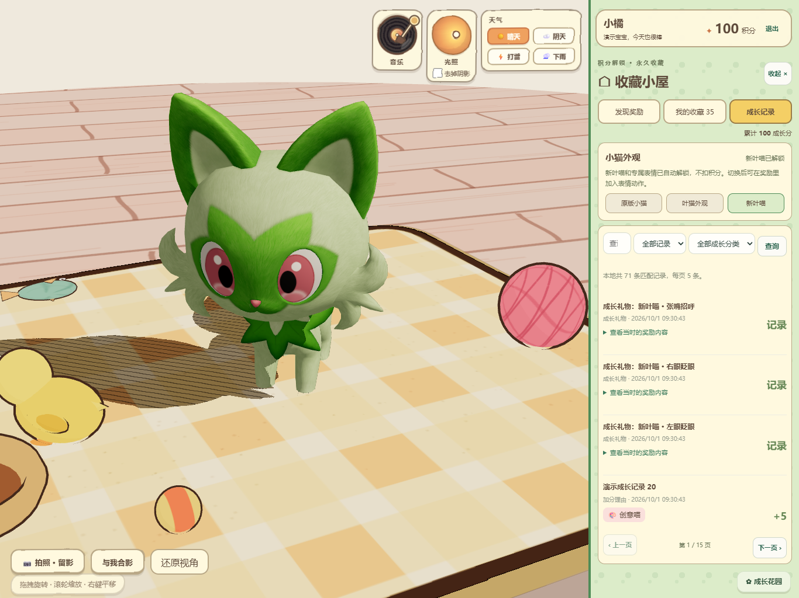
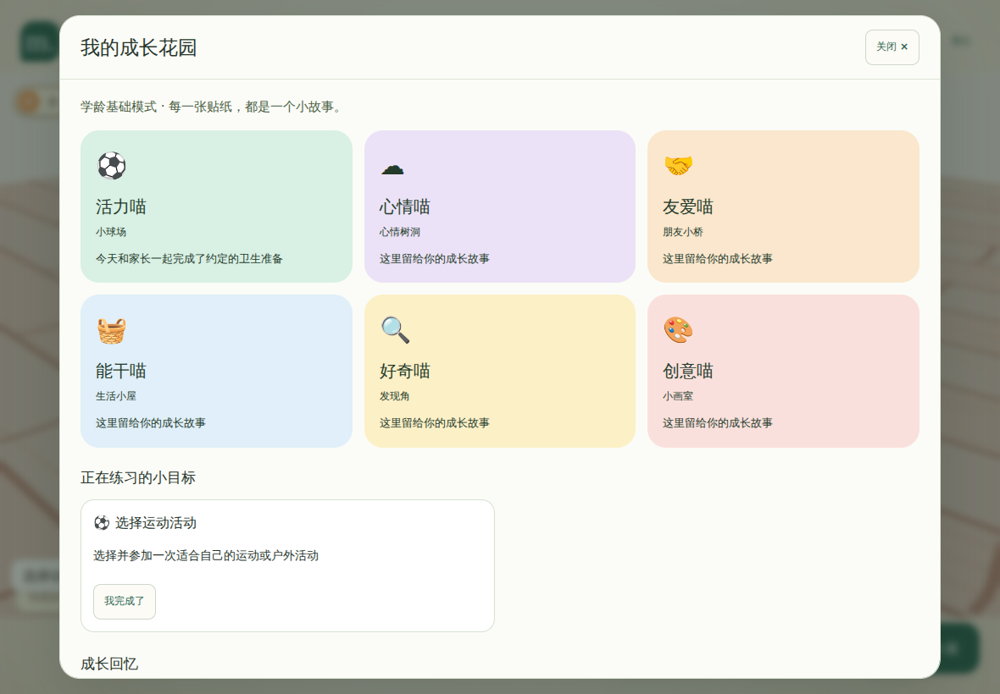
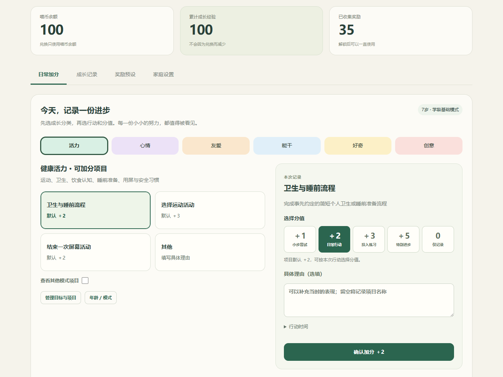
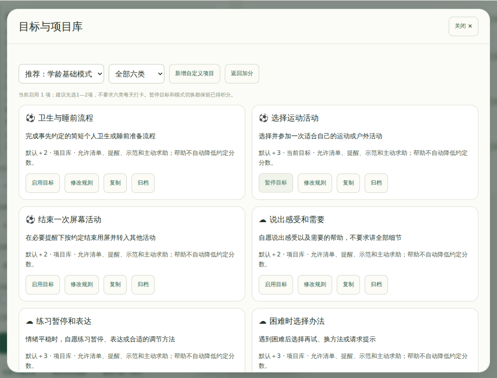
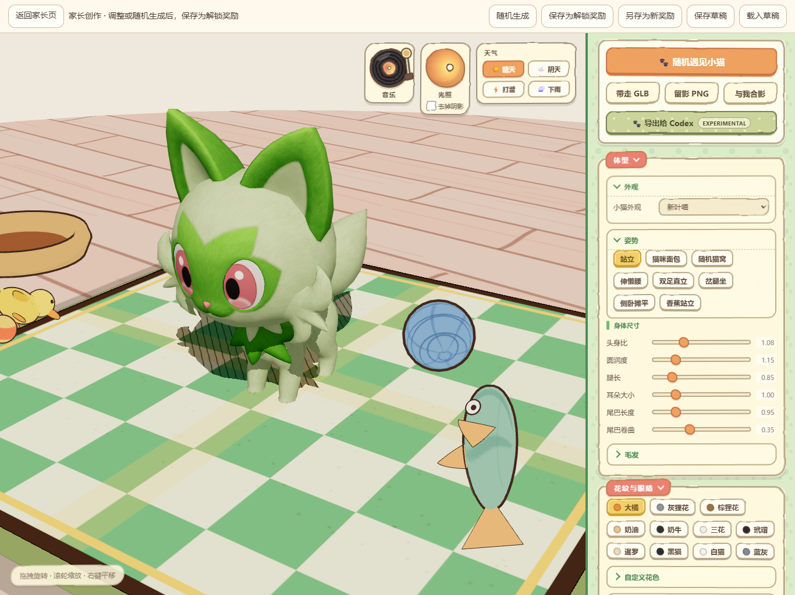

<div align="center">

# Meow · 小猫成长花园

一个把现实中的小小努力，变成成长回忆、小猫装扮和房间礼物的自托管家庭应用。

**3—10岁 · 三种成长模式 · 六类成长记录 · 三种小猫外观 · 随机动作脚本 · 本机合影**

[小猫与动作](#小猫外观与随机动作) · [本地运行](#本地运行) · [家长加分指南](pet/GROWTH_GUIDE.md) · [接口文档](pet/GROWTH_API.md) · [反馈问题](https://github.com/cy677/Meow/issues)

[非商业源码开放授权](LICENSE) · [商业使用与合作](COMMERCIAL-LICENSE.md) · [原版项目](https://github.com/ringhyacinth/Meow-Generator)

</div>



<p align="center"><sub>儿童首页直接与小猫互动，小猫自动播放已选动作；装扮和房间内容来自已拥有的奖励。本文配图为实际程序截图，使用临时演示账户，积分与昵称不代表真实家庭数据。</sub></p>

## 关于 Meow

**Meow · 小猫成长花园**是在 **Meow Generator** 基础上改造的家庭积分宠物。原版由 **Simon_阿文（Simon Lee）** 与 **海辛（Ring Hyacinth）** 共同创作，提供程序化小猫、软体触摸、骨骼动作、物理玩具、天气和收藏卡片；本分支增加适龄目标、家长加分依据、成长记录与奖励管理。

孩子在现实生活中完成事先约定的小行动，家长核对完成情况、选择分值并确认，必要时补充具体理由。喵币用于兑换花色、眼睛、猫窝、木地板、玩具及家长保存的完整作品。小猫保持正常互动，不因没有积分、没有登录或未完成任务而挨饿、生病或离开。

**家庭版有账户和 Node.js 服务，业务数据保存在运行该服务的电脑或服务器上的 SQLite 数据库中，不在 iPad 浏览器里。** 家庭电脑部署时数据在家庭电脑；公网服务器部署时数据在该服务器。积分、加分理由、奖励预设和兑换记录通过当前服务读写，不自动同步到 GitHub 或其他第三方平台。原版静态生成器的“无后端、无需登录”说明不适用于家庭积分服务。

摄像头画面和合影照片另外处理：只在当前 iPad 浏览器内存中合成、预览，由用户通过系统菜单或长按图片存入“照片”。Meow 不上传照片、不建立网页相册，也不把照片写入 SQLite、IndexedDB 或 localStorage。

## 主要功能

当前 `main` 已包含**新叶喵模型与成长解锁、可选随机动作脚本、玩具接触互动，以及14项模型礼物**。下列功能均随程序发布；小猫模型、动作与房间素材不需要从外部服务加载。

- **三种小猫外观**：原版小猫默认可用；累计50成长分解锁叶猫外观，100成长分解锁独立模型“新叶喵”及三项专属表情，不扣喵币。
- **随机动作与直接互动**：21个基础动作默认可用；已拥有的姿态和特色动作可加入或移出随机脚本。保留触摸、提起、物理玩具、光照、天气和拍照，儿童首页由小猫自动表演。[动作规则](pet/MOTION.md)。
- **房间与模型礼物**：小鸡、小兔、蜜蜂、毛毛虫，三种玩具车、带斜面碰撞的坡道、两盒积木，以及矮凳、边桌、低书架和可开关落地灯。在“收藏小屋 → 模型礼物”兑换、装备；家长可调整价格和门槛。[交互与维护说明](pet/MODEL_REWARDS.md)。
- **适龄成长目标**：家长初始化填写年龄，确认学前、学龄基础或学龄进阶模式；内置66个项目，支持自定义和分步任务。
- **家长确认加分**：按六类选择项目卡片，核对完成条件，选择分值后确认；预设项目理由选填，“其他”必须填写具体理由，孩子提交需家长确认。
- **成长花园与回忆**：六个并列分类、3×2卡片、分页记录与近期分布，不给孩子的能力或心理健康排名。
- **奖励与服务端数据管理**：喵币与累计经验分开；家长保存固定外观和场景作品；支持旧数据迁移、记录查询、JSON导出及数据库备份。

## 小猫外观与随机动作



| 外观 | 解锁条件 | 内容 |
| --- | --- | --- |
| **原版小猫** | 默认可用 | 程序化小猫，可使用已拥有的花色、体型和眼睛奖励 |
| **叶猫外观** | 累计50成长分 | 沿用原版身体与动作，增加绿色配色、叶片领结与脸颊毛簇 |
| **新叶喵** | 累计100成长分 | 独立GLB模型与原材质，沿用共享动作播放器；同时获得左眼眨眼、右眼眨眼和张嘴招呼 |

儿童进入 **“收藏小屋 → 成长记录 → 小猫外观”**，切换已解锁的外观。解锁和切换不扣余额；兑换其他物品不会减少累计成长分。新叶喵使用自身模型与材质，静态造型支持站立和舒展，不适用原版的所有变形姿态。

在 **“收藏小屋 → 互动动作”** 或“我的收藏”中，点击“加入随机脚本”或“从脚本中删除”，选择小猫平时会做的动作。21个基础动作免费、默认加入；招爪问好、礼貌鞠躬、歪头卖萌和欢乐庆祝等特色奖励拥有后可加入。移出脚本不取消所有权。新叶喵专属表情只在该外观下播放，切回原版时自动排除，切回新叶喵后保留之前的选择。

小猫在动作之间短暂休息，按打乱的顺序轮播所选动作。**儿童首页使用自动脚本，已取消手动方向键、键盘移动与动作下拉。** 抚摸、拖动、拍照或打开弹窗时，自动动作会暂停或让位；清空所选动作后仍可直接与小猫互动。

警觉、行走和前爪轻拍都加入脚本时，小猫会观察并靠近附近的球、毛线团、小鱼布偶或小鸭，爪子进入接触范围才施加小幅推动。移出任意一项可停止自动玩具互动。攀爬和翻越动作属于原地练习；家具提供现有碰撞，不包含家具攀爬或自动寻路。

## 三种成长模式

首次使用时，家长填写孩子的周岁并确认模式。**6岁可结合是否入学选择，年龄仅用于推荐，不锁定模式。**

| 模式 | 参考阶段 | 默认项目与参与方式 |
| --- | --- | --- |
| **学前模式** | 3—6岁，主要面向尚未入学的儿童 | 30个预设；生活与游戏中一次一个小步骤，允许示范和共同完成，主要由家长记录 |
| **学龄基础模式** | 6—8岁参考 | 18个预设；简短流程、学习准备、同伴合作和家庭责任，孩子可以提交完成情况 |
| **学龄进阶模式** | 9—10岁参考 | 18个预设；目标选择、任务拆分、检查与协商，支持多日小项目和分步记录 |

修改年龄不会自动切换模式。切换模式只更新推荐和展示方式，**不清空积分、记录和收藏，不自动替换已启用目标或进行中的项目**。家长仍可选用其他模式中合适的项目。

初始化不强制启用目标。建议先选1—2个正在练习的小目标，进阶模式可选2—3个；66个预设是项目库，不是每日必须完成的任务表。

## 六类成长花园



<p align="center"><sub>六类并列、不分高低。点开卡片查看具体行动和回忆，没有记录的分类不会变灰或枯萎。</sub></p>

| 主分类 | 儿童名称 | 归类范围 |
| --- | --- | --- |
| **健康活力** | ⚽ 活力喵 | 运动、卫生、饮食认知、睡前准备、安全和用屏习惯 |
| **情绪与自我** | ☁️ 心情喵 | 自愿表达感受、求助、调节方法、自我认识与挫折应对 |
| **交往与关爱** | 🤝 友爱喵 | 倾听、合作、关爱、协商和个人边界 |
| **自理与责任** | 🧺 能干喵 | 自理、整理、家务、履行约定与失误补救 |
| **学习与探索** | 🔍 好奇喵 | 阅读、观察、提问、学习方法、尝试和检查 |
| **创意与审美** | 🎨 创意喵 | 绘画、音乐、手工、故事、想象游戏和欣赏 |

按照本次主要鼓励的行动选择一个主类别，同一行动只奖励一次。例如，搭积木时鼓励合作归“友爱喵”，鼓励研究怎样搭得稳归“好奇喵”，鼓励设计造型归“创意喵”。

## 家长加分依据

在家长页的 **“日常加分”** 中，先选六类之一，再点具体项目卡片。页面展示该项目的**完成条件和默认分值**，家长选择分值后点击“确认加分”；需要调整发生时间时，可展开“行动时间”。



<p align="center"><sub>选择预设项目时，具体理由可以留空，账本记录项目名称；分步项目会附上步骤名称。选择“其他”时必须填写真实、具体的理由。所有加分仍需家长确认。</sub></p>

| 分值 | 名称 | 加分依据 |
| --- | --- | --- |
| **＋1** | 小步尝试 | 事先约定只尝试一个很小的步骤 |
| **＋2** | 日常行动 | 完成一个清楚、适龄的日常行为；自定义项目默认值 |
| **＋3** | 投入练习 | 完成一段活动，或尝试解决一个问题 |
| **＋5** | 特别进步 | 相对孩子自身起点的明显进步，或事先约定的小挑战 |
| **0** | 仅记录 | 留下成长回忆，不增加喵币与经验 |

普通项目可以选择以上分值；多日项目按事先约定的步骤分值结算，也可以仅记录。建议在行动前说明本次约定。**成人提醒、清单、示范、共同完成或主动求助不自动减分。** 补充理由时应描述具体行动，例如“今天整理书包时，你照着清单检查了水杯和作业本”，而不只是“今天很乖”。

不以成绩排名、吃光饭菜、立刻睡着、保持开心、不哭、服从或公开隐私作为默认奖励条件。安慰、安全、基本照护和亲子陪伴不需要积分兑换。

项目的允许帮助、理由示例、参考来源与适用范围见 **[家长加分指南](pet/GROWTH_GUIDE.md)**。指南文件随源码提供，打开其中的参考原文链接需要联网。六类、模式和分值是产品配置，不是指南规定的评分表、发育达标线或心理筛查，不代表相关机构认可本产品。

## 目标、记录和确认



<p align="center"><sub>项目库与当前目标分开。家长选择少量目标，用普通表单修改规则，不需要编辑JSON。</sub></p>

家长在 **“日常加分 → 管理目标与项目”** 启用、暂停或归档项目。未启用项目不显示失败或缺勤，也可以单独记录自然发生的小行动。

普通项目默认每天最多计分一次，可事先配置1—4次，或设为只记录一次。家庭时区决定计分日期，行为时间与录入时间分别保存。**计分频次不是刷牙、运动等实际行为的健康推荐频次。**

学龄孩子点击 **“我完成了”** 后，只产生待确认记录，不直接增加积分。说明可留空，不要求提交照片或隐私。家长核对并确认后入账；提交时的规则快照会保留，后续修改项目或切换模式不改变已提交的约定。

多日项目最多设置12个步骤，按步骤分别计分，不再重复领取项目总分。暂停时保留已完成步骤；已有记录的项目需要改变步骤时，应复制为新项目。

### 看见成长，不做能力排名

记录支持按类型、理由文字和六类筛选，并用游标翻页查看完整历史。儿童成长花园按每页5条展示最近100条分类回忆，更早的完整记录可在“收藏小屋 → 成长记录”查询；家长在“成长记录”页查看近7天或近30天的记录分布。

**图表只表示家庭记录了哪些行动，不代表孩子的能力或健康水平。** 六类数量不要求相等；没有记录可能只是没有登记，不应被解释为孩子存在某方面的不足。

## 小猫奖励与家长创作



<p align="center"><sub>家长可以随机生成后继续调整，并保存为固定作品。预览和私有草稿不改变孩子当前的小猫。</sub></p>

**喵币余额**用于兑换，购买后减少；**累计成长经验**不因兑换减少；**六类成长记录**保留具体行动和当时的规则。默认每加1分，同时获得1枚喵币和1点成长经验。

内置2枚喵币、无经验门槛的“薄荷小眼睛”，让一个普通小目标即可兑换小礼物。原有奖励ID、家长自定义价格、解锁门槛和所有权不会被批量重置。

家长在 **“奖励预设 → 新增奖励预设”** 或已有奖励的“调参数”中编辑单项奖励；完整场景在 **“奖励预设 → 生成奖励 / 参数面板”**（`/studio.html?mode=parent`）调整或随机生成，再点击“保存为解锁奖励”。原版小猫可以调整花色、体型、眼睛和姿态，房间可调整木地板、垫子及其他原版参数。兑换价格与累计经验门槛分别设置；孩子兑换并使用后获得已保存的固定作品，不会重新随机。儿童当前使用的小猫外观仍由已解锁的外观选择决定。

已兑换物品重复使用不再次收费。21个基础动作无需积分或兑换，家长也不能为它们设置门槛；特色动作与连续表演仍可设置奖励规则。抚摸、天气、光照、音乐和拍照保持可用。参数编辑、随机生成、GLB与Codex宠物导出仅在家长创作页提供。

## 与小猫合影

儿童场景直接提供 **“拍照 · 留影”** 和 **“与我合影”** 两个入口：前者制作小猫纪念卡，后者打开摄像头合影。首次允许 Safari 使用摄像头，默认前置镜头，可切换前后镜头或关闭自拍镜像。单指拖动调整小猫在画面中的位置，双指张合调整大小，“还原构图”恢复本次默认视角。地板、天气等房间内容只在合影渲染时隐藏，不修改已拥有奖励或持久化装扮。

拍摄后先显示最终照片，并立即关闭摄像头。点“存储到 iPad 照片”，在系统菜单中选择“存储图像”；没有文件分享功能时可长按预览图片存储。系统菜单可以提供其他目标，网页不能强制选择某个目标，也无法读取系统相册确认是否保存。关闭预览后未保存的照片不保留。照片库自身的 iCloud 同步由设备设置控制，不是 Meow 上传。

家庭版普通小猫纪念卡也采用预览和系统保存，不自动下载到“文件”；原版独立静态生成器的场景 PNG 导出接口保留。预览与导出图片均已移除底部仓库链接栏，仓库的许可证和原作者说明不变。

摄像头需要浏览器信任的 HTTPS 和用户授权。公开可信 CA 签发、覆盖访问地址且有效的证书不需要在 iPad 上额外安装；自建 CA 才需要在受管理设备上安装并信任。服务器与同源 iframe 均须允许 `camera=(self)`，反向代理不能再注入 `camera=()`。麦克风仍然禁用。功能边界和验收说明见 [第一版合影说明](docs/photo-v1.md)。

## 本地运行

需要 **Node.js 22.16.0或兼容的更新版本**、npm和支持WebGL的浏览器。当前 `main` 已包含家庭成长服务与新叶喵；首次安装可克隆后在项目根目录执行：

```bash
git clone https://github.com/cy677/Meow.git
cd Meow
npm ci --ignore-scripts
npm run pet:build
npm run pet:lan
```

终端会打印实际局域网地址，例如 `http://192.168.1.100:8792`。让iPad与电脑处于同一可信局域网，用浏览器打开该地址，电脑需要保持运行。首次安装依赖需要联网；构建后的家庭功能不依赖外部模型或云端服务。

### 首次设置

打开 `http://电脑IP:8792/parent.html`，使用终端显示的一次性初始化口令，设置家长密码、不同的孩子进入码、昵称、小猫名字、周岁和成长模式。初始化口令不应当作孩子进入码分享；不要求真实姓名或完整出生日期。

Windows用户完成构建后，也可使用根目录的 **`一键启动.cmd`**。该入口读取 `pet-settings.json`；已有端口或数据目录配置应保留，不要在更新时覆盖。

### 其他启动方式

```bash
npm run pet:start      # 只在本机使用
npm run pet:dev        # 积分应用开发服务
npm run pet:lan:https  # 配好受信任证书后使用
```

`npm run pet:dev` 会启动家庭服务及开发页面，无需先构建；开发模式不与HTTPS启动合用。`npm run dev` / `npm run build` 对应独立静态编辑器，保留随机生成、参数编辑和导出。GitHub Pages只能承载静态内容，不能运行SQLite家庭账本服务。

局域网HTTP不加密，不要把家长界面或服务端口直接暴露到公网。防火墙、HTTPS和陀螺仪配置见 **[平板部署说明](pet/PAD.md)**。家庭版以横屏iPad使用为主，系统权限与实际触摸表现仍需在真实设备上核查。

## 更新与数据保存

> **更新代码不等于重置数据。先停止服务，备份实际数据目录及修改过的 `pet-settings.json`，再覆盖程序文件。不要先删除整个旧项目，也不要运行 `清除数据.cmd` 来更新。**

默认数据文件为 `pet/data/pet.sqlite`。若设置过其他 `dataDir` 或 `MEOW_DATA_DIR`，应以启动窗口显示的实际数据库位置为准。保留整个数据目录，包括仍存在的SQLite附属文件，并保留自己使用的证书、私钥和本地配置。

首次打开旧库时，程序增量增加字段与成长表，不删除原流水、不推测年龄、不擅自分类、不重复发币，也不重定价已有奖励。旧用户在家长页补充年龄与模式，儿童仍可使用原有小猫和收藏。

旧加分由家长在 **“待归类旧记录”** 中核对并填写依据；归类不改变原时间、金额或余额。更新后提示补全年龄和模式是正常的；若要求重新创建家长密码和孩子进入码，应先检查是否打开了错误的数据目录。

误录更正必须关联原记录并说明原因，不是惩罚性扣分。原记录和审计保留；余额不足时拒绝更正，不透支或自动回收物品。累计经验和已解锁权益保留，被更正记录不计入成长分布。

家长页可导出完整JSON记录，不包含密码或会话。**JSON用于查阅，不提供自动导入恢复。** 恢复备份应先停止服务，再恢复完整SQLite数据目录。关闭网页或清理浏览器缓存不会删除运行服务的电脑或服务器上的数据库。

旧 `/api/parent/points` 仅保留作已有本地客户端兼容，新页面不调用它，也不提供任意负分输入。新成长接口执行分类、分值、项目版本和频次校验。重复网络请求不会重复入账，但系统不能自动判断不同文字是否描述同一次现实行动，仍需家长避免重复登记。

## 操作方式

| 入口 | 操作 |
| --- | --- |
| **儿童首页** | 直接触摸、提起小猫或拖动玩具；自动播放所选动作；直接使用拍照、合影与还原视角 |
| **成长花园** | 查看六类卡片和回忆；学龄模式可提交当前目标，等待家长确认 |
| **收藏小屋 / 我的收藏** | 分类、分页查看奖励，确认兑换或重复使用；姿态与动作可加入或移出随机脚本 |
| **收藏小屋 → 成长记录** | 查询完整流水，在“小猫外观”中切换已解锁的原版、叶猫或新叶喵 |
| **家长日常加分** | 选择分类与项目卡片、核对完成条件和分值，按需补充理由后确认，也可仅记录不加分 |
| **家长奖励预设 / 创作页** | 调整奖励价格和门槛，编辑单项参数或完整作品；创作页保存私有草稿、奖励作品并导出模型 |

场景保留相机旋转、缩放、平移，以及玩具抓取与投掷；原版小猫和叶猫沿用软体触摸与脸颊互动。**家长入口为 `/parent.html`，儿童首页和登录页不显示家长链接。** 原版功能的接入历史见 [原版功能对照](pet/UPSTREAM_PARITY.md)；免费动作与当前随机播放规则见 [动作说明](pet/MOTION.md) 的“当前规则”。

## 项目结构

| 路径 | 作用 |
| --- | --- |
| `pet/growthCatalog.mjs` | 三种模式、六类分类、66个项目及家长加分依据 |
| `pet/growthStore.mjs` | 年龄与目标、规则快照、日限、待确认、分类和更正 |
| `pet/growthUI.js` / `pet/growth.css` | 家长表单、儿童成长花园及记录分布 |
| `pet/server.mjs` / `pet/api/` / `pet/services/` / `pet/repositories/` | HTTP接口、角色权限、业务服务及SQLite持久化 |
| `pet/store.mjs` / `pet/localLedger.mjs` | 兼容存储入口与积分流水 |
| `pet/homeRuntime.js` / `pet/runtime/` | 儿童首页共享运行时、随机脚本与玩具接触互动 |
| `src/catAppearance/` / `src/assets/sprigatito-0906.glb` | 三种小猫外观与新叶喵模型、材质和表情 |
| `src/catMotion/` / `pet/sprigatitoRewards.mjs` | 动作片段、播放与衔接、新叶喵专属表情奖励 |
| `pet/modelCatalog.mjs` / `public/models/kenney/` | 14项模型礼物、已审核GLB及预览图 |
| `pet/data/` / `pet-settings.json` | 默认运行数据目录与Windows启动配置，升级时保留 |
| `docs/readme/` | 本文实际界面截图及其来源说明 |
| `src/`、`public/`、`third_party/` | 原版小猫实现、素材、动作数据及第三方署名 |

详细资料：[家长加分指南](pet/GROWTH_GUIDE.md) · [成长接口说明](pet/GROWTH_API.md) · [家庭应用说明](pet/README.md) · [平板部署](pet/PAD.md)。

## 构建检查

```bash
npm run pet:build
npm run build
```

测试脚本已从仓库移除；以上命令只检查两种网页构建。

本文首页、新叶喵、家长加分和家长创作截图来自本次对当前 `main` 的实际浏览器预览；成长花园与项目库配图保留此前浏览器回归中的截图。均使用临时演示账户，未修改界面数值或生成演示UI。各图的来源版本与处理方式见 [配图说明](docs/readme/README.md)。浏览器预览或回归结果不代表真实iPad Safari认证。

## 创作者、素材与授权

原版 **Meow Generator** 由 **Simon_阿文（Simon Lee）** 与 **海辛（Ring Hyacinth）** 共同制作。本分支的家庭积分功能建立在原版模型、交互、场景、音频和导出模块之上，README改写不移除原作署名。

**Required Notice: Copyright 2026 Simon_阿文 (Simon Lee) and Ring Hyacinth (海辛).**

`src/mesh2motionClips.json` 的精简动作数据及授权见 [Mesh2Motion素材说明](third_party/mesh2motion/README.md)。Three.js、Cannon-es、Vite及其他第三方内容保留各自许可证。

14项模型礼物使用 Kenney 的 Cube Pets、Toy Car Kit、Brick Kit 和 Furniture Kit 素材，其CC0许可、原始包与逐文件来源见 [Kenney素材说明](third_party/kenney/README.md)。第三方素材许可不改变仓库程序的许可。

仓库沿用 [PolyForm Noncommercial License 1.0.0](LICENSE)，不是MIT或Apache许可。具体使用、修改与分发以许可证原文为准；商业使用与合作请阅读 [COMMERCIAL-LICENSE.md](COMMERCIAL-LICENSE.md)，并按原作说明联系取得相应授权。

## 当前状态

家庭成长功能、三种小猫外观、自动动作脚本、玩具接触互动和本地奖励管理已接入当前 `main`。新叶喵复用原有骨骼动作与共享播放器，保留模型自身材质与表情。原版Motion、容器软体和Codex宠物导出仍保留实验性质，设备性能、极端参数及长时间WebGL运行表现可能不同。

第一版摄像头合影已经接入；本版尚未接入语音大模型或心理自动判断。家长功能与儿童权限在服务端分离；分类与分值用于家庭记录和鼓励，不用于心理筛查、诊断或儿童之间的比较。

欢迎提交可复现的问题与使用反馈。反馈时请勿公开家庭数据库、密码、初始化口令或孩子的私密记录。
