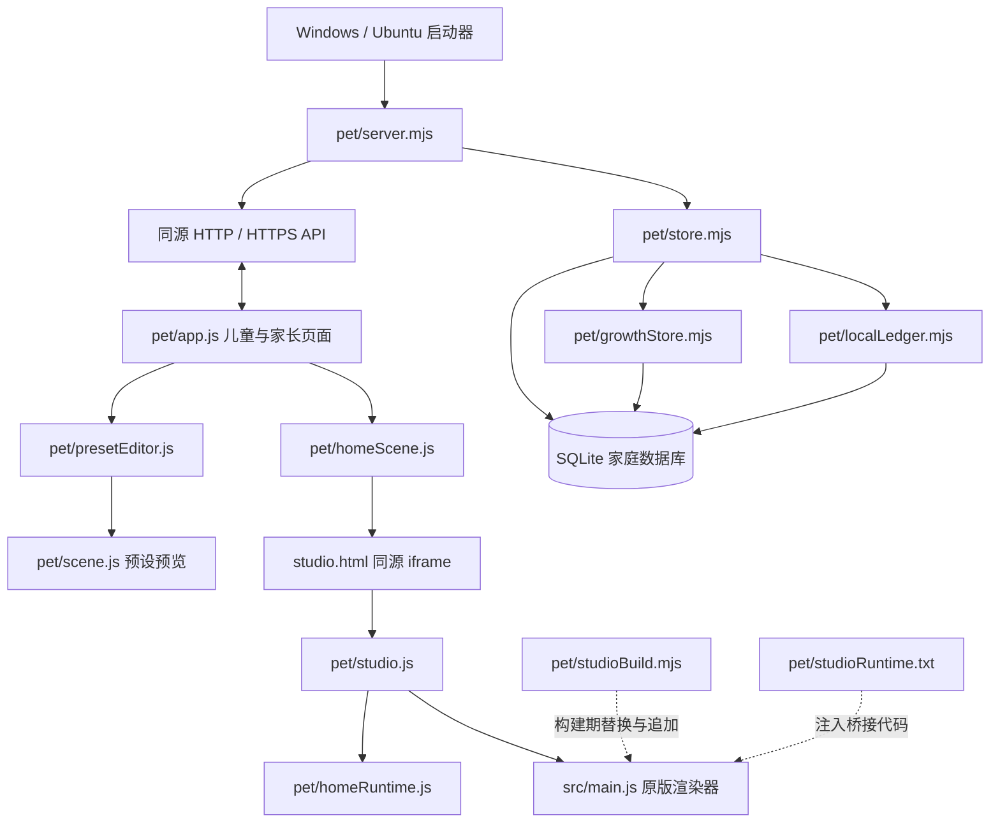

# Meow 代码维护手册

> 审核日期：2026-09-19  
> 仓库：`cy677/Meow`  
> 审核基线：`main` 的 `9903a5bfa6628e346c7cce56876689c304a6ba80`，提交说明为 `feat: refine growth flows and add Ubuntu updater`。  
> 本文是维护说明和代码审核报告，不代表所列问题已经修复。本次不修改业务代码、家庭数据库、用户配置或主分支。

## 1. 审核结论与使用方式

当前项目适合继续采用“本地 Node.js 服务 + SQLite + 浏览器界面 + Three.js 渲染”的模块化单体结构。积分交易、幂等控制、角色隔离、历史快照和部分迁移测试已经具备基础，没有必要为了维护而改成微服务、替换数据库或立即迁移整个前端框架。

主要维护风险集中在三个边界：**程序更新与家庭数据之间的边界，原版渲染器与积分系统之间的边界，以及界面变更与测试之间的边界**。其中，迁移识别自定义奖励不准确、更新器校验范围小于复制范围、启动器覆盖监听配置，以及构建期文本注入未检查匹配结果，均有隔离复现证据。

本文先说明现状，再列出问题与整改方法。维护时应优先查阅第 6 节的问题清单、第 8 节的修改入口表，以及第 9 节的数据保护流程。源代码链接固定到审核提交，避免后续改动导致证据位置漂移。

### 1.1 优先级与证据等级

- **P1**：应在下一次对已有家庭安装进行升级或对外部署前处理，涉及用户数据、更新可靠性、网络暴露或关键回归保障。
- **P2**：应纳入近期维护迭代，主要影响扩展成本、配置一致性、定位能力和长期性能。
- **已复现**：执行了隔离探针或当前提交的自动化测试；**静态确认**：可以直接从代码确认结构或行为；**待验证风险**：影响取决于部署、数据规模或未来修改，不能视为已发生故障。

| 编号 | 优先级 | 问题 | 证据 |
| --- | --- | --- | --- |
| A01 | P1 | 启动器强制将 `MEOW_HOST` 改为 `0.0.0.0` | Ubuntu 隔离复现，Windows 静态确认 |
| A02 | P1 | 更新器校验 manifest 后，仍整体复制未逐项校验的 `pet/dist` | 隔离复现 |
| A03 | P1 | 奖励迁移通过描述文案识别默认项，可能改写自定义免费动作价格 | 隔离复现 |
| A04 | P1 | 原版集成依赖源码字符串替换，匹配失败不报错 | 隔离复现 |
| A05 | P1 | 当前两套浏览器回归均被过时断言或选择器阻断 | 当前基线 CI 实测 |
| A06 | P1 | 程序回滚与数据迁移回滚没有形成完整闭环 | 静态确认，异常中断影响待验证 |
| A07 | P2 | 默认成长任务使用数组下标生成持久化 ID | 静态确认，后续调整存在风险 |
| A08 | P2 | 发布名称、日期、旧安装目录及 Node 许可证路径写死 | 静态确认 |
| A09 | P2 | CI 的 PR 路径过滤未覆盖全部跨目录依赖，Windows 分支未运行 | 静态确认及测试结果 |
| A10 | P2 | 运行时版本约束分散，浏览器测试依赖不在锁文件中 | 静态确认及 CI 安装日志 |
| A11 | P2 | 入口职责集中，业务代码过度压行，渲染存在双路径维护成本 | 静态确认 |
| A12 | P2 | `growth.configure(null)` 在对象校验前读取属性 | 隔离复现 |
| A13 | P2 | 高频完整快照、目录重复校验、成长任务逐项计数 | 静态确认，性能影响待测 |
| A14 | P1 | 默认配置文件与家庭实际配置共用受版本控制的路径 | 静态确认，覆盖风险取决于更新方式 |
| A15 | P2 | GitHub Pages 构建路径仍写死为上游仓库名称 | 静态确认，线上部署未验证 |
| A16 | P2 | API 错误契约和运行诊断信息未集中管理 | 静态确认 |

本次没有据此认定存在匿名远程执行、已经发生家庭数据丢失，或所有场景均不能使用。问题影响范围应以各项说明为准。

## 2. 当前架构

### 2.1 三种运行入口不能混为一谈

| 入口 | 构建或启动命令 | 作用及边界 |
| --- | --- | --- |
| 原版生成器 | `npm run dev`、`npm run build` | 根目录 `index.html` 与 `src/main.js`；根构建输出到 `dist/` |
| 家庭积分系统 | `npm run pet:dev`、`npm run pet:build`、`npm run pet:start` | `pet/server.mjs` 提供 API、数据库和页面；页面构建输出到 `pet/dist/` |
| 小工具适配版本 | `npm run build:minitool` | 独立 Vite 配置及平台适配模块，不等于家庭积分服务 |

根目录的 GitHub Pages 工作流只构建原版静态页面，不能据此认为 SQLite 积分服务已经部署。家庭系统需要持续运行的 Node.js 服务。[S01][S02][S03]

### 2.2 运行关系



上图中的构建期箭头不是普通模块调用。`studioBuild.mjs` 修改原版 HTML，并对 `src/main.js` 执行字符串替换，再追加 `studioRuntime.txt`。因此只检查 ES 模块的 `import` 关系，不能完整表达当前依赖。[S04]

### 2.3 应当保留的设计

数据库写入通过事务处理积分、所有权、流水和幂等记录；重复购买与重复加分已有测试。`balance` 与 `lifetime` 分开保存，避免兑换物品降低累计成长值。奖励和成长记录保存历史快照，家长草稿与儿童实际装备作品相互隔离。这些是重构必须保持的行为，不应为了简化代码而合并为一个积分字段或直接读取现行规则代替历史规则。[S05][S06][S07]

服务端已实现角色会话、CSRF、Host/Origin 校验、密码派生存储、静态文件路径边界检查和 TLS 配置校验。`homeScene.js` 也有同源与消息来源检查、就绪超时和清理逻辑。不能将这些模块简单描述成“完全没有安全校验”或“iframe 没有销毁”。[S08][S09]

## 3. 目录和模块职责

| 路径 | 当前职责 | 维护注意事项 |
| --- | --- | --- |
| `pet/server.mjs` | HTTP/HTTPS、鉴权、会话、路由、静态资源、启动退出 | 不应继续塞入业务计算或新的发布操作 |
| `pet/store.mjs` | 账户、目录、兑换、装备、作品、迁移入口及事务协调 | 是积分一致性的核心，修改必须带回归测试 |
| `pet/localLedger.mjs` | 流水表升级、记录写入、快照、分页与查询 | 历史金额、原因与发生时间不能被普通配置编辑改写 |
| `pet/growthStore.mjs` | 年龄模式、任务、提交确认、计分、更正及统计 | 与账户事务共用连接，不可拆成失去原子性的独立写入 |
| `pet/growthCatalog.mjs` | 三种模式、六个分类、加分说明与默认任务 | 默认数据进入数据库后，修改源码并不等于修改已有家庭规则 |
| `pet/catalog.mjs`、`validation.mjs` | 奖励与通用字段校验 | 白名单、边界和报错应由界面与服务端共同遵守 |
| `pet/presetSchema.mjs`、`environmentSchema.mjs`、`studioSchema.mjs` | 外形、场景、完整作品参数契约 | 增加字段要核对默认值、校验、保存和实际渲染 |
| `pet/app.js`、`growthUI.js`、`history.js`、`childLayout.js` | 页面组织、表单、奖励、记录与儿童布局 | 不应自行决定真实余额、所有权或计分次数 |
| `pet/homeScene.js`、`studio.js`、`homeRuntime.js` | 原版场景嵌入、就绪通信、运行态和自动动作 | 处理鉴权失效、页面隐藏、交互暂停与资源清理 |
| `pet/studioBuild.mjs`、`studioRuntime.txt` | 构建期原版适配 | 是最高耦合区域，格式化原版入口前也要测试 |
| `pet/scene.js`、`environment/`、`skeletalPlayer.js` | 预设预览与场景、骨骼适配 | 并非全部废弃代码；`presetEditor.js` 仍使用该路径 |
| `pet/motionPrograms.mjs`、`motionTimeline.js` | 动作白名单、脚本与时间线 | 保留数据驱动方式，不接受任意脚本或远程代码 |
| `src/main.js` | 原版场景初始化、控制面板、渲染循环和交互组装 | 是拆分首要对象，但不能一次性大规模搬动 |
| `src/catBuilder.js`、骨骼及材质相关模块 | 几何、骨骼、着色及姿态 | 大量数值是算法参数，应先命名和注释，不宜全部配置化 |
| `scripts/`、`Meow`、两个 `.cmd` | 启动、打包、更新、验证及平台适配 | 修改时必须区分程序目录、数据目录和测试目录 |
| `.github/workflows/` | 原版静态发布、积分与成长检查 | 必须覆盖跨目录依赖，不能只看 `pet/**` |

`catDialogue.js` 和 `motionTimeline.js` 等文件可能通过追加的桥接文本进入实际构建，不能仅因普通 JS 导入图中入度为零就删除。同理，`#platform` 等别名和小工具适配文件也必须结合构建配置判断。[S01][S04]

## 4. 数据模型与不可破坏的约束

### 4.1 数据保存位置

家庭业务数据保存于服务端 SQLite，默认是 `pet/data/pet.sqlite`，不是 iPad 浏览器的本地存储。`MEOW_DATA_DIR` 或启动器读取的配置可以改变位置。浏览器端的临时交互状态不应被当成账户事实来源。[S08][S10][S11]

| 数据 | 主要位置 | 更新时的要求 |
| --- | --- | --- |
| 余额、累计成长、昵称、状态版本 | `profile` | 保留原值；修订通过业务事务完成 |
| 奖励目录、成长档案、作品草稿、迁移标记 | `settings` | 不得拿发行包默认值整体覆盖 |
| 所有权与装备 | `owned`、`equipped` | 稳定 ID 不变，装备必须指向已拥有项 |
| 加分、兑换、更正、礼物等记录 | `ledger` | 保留原始金额、理由和历史快照 |
| 请求幂等记录 | `requests` | 迁移或恢复时与业务状态一起保留 |
| 家长与儿童凭据、会话 | `credentials`、`sessions` | 不写入普通导出或公共诊断包 |
| 成长任务及规则版本 | `growth_tasks` | 保留家长修改及任务标识 |
| 待确认任务提交 | `growth_submissions` | 保留提交时规则快照与待处理状态 |
| 成长审计与更正关联 | `growth_audit`、`growth_corrections` | 保持关联完整，避免重复结算 |
| 服务端口、数据目录等 | `pet-settings.json` | 是安装配置，不是发行包应强制覆盖的默认模板 |
| HTTPS 私钥与证书 | 配置指定的外部文件 | 单独保护和备份，不进入 Git 或补丁 |

当前 `profile` 通过 `CHECK(id=1)` 明确只保存一个档案。这是单家庭、单儿童模型，不应误称为可直接支持多家庭或多儿童。今后支持多个儿童时，需要贯穿账户、流水、任务、幂等键和会话作用域的迁移，不能只增加一个昵称下拉框。[S05]

### 4.2 必须保持的业务不变量

1. 同一成功幂等请求不能再次改变积分；请求 ID 被用于不同内容时应明确拒绝。购买的金额、所有权、流水及请求记录须处于同一事务。
2. 余额与累计成长是不同概念。兑换不降低累计成长，普通更正不直接回收已拥有物品；更正行为必须沿用现有业务规则和关联记录。
3. 家长改价不应改变历史兑换快照。任务条件修改不应倒推修改既有成长记录或待确认提交的规则快照。
4. 家长草稿不应自动替换儿童场景。作品保存为奖励、儿童获得所有权以及装备作品，是不同步骤。

`localLedger.mjs` 的注释称流水为追加式，但成长系统允许给旧记录补充分类等元数据。因此应将约束写成“原始交易信息与历史快照受保护，更正和归类有审计”，而不是笼统声称所有列永远不更新。[S06][S07]

### 4.3 各种“版本”含义不同

`profile.version` 用于整体状态变更；目录 revision 是目录内容的哈希；任务 revision 用于任务乐观并发控制；作品草稿 revision 是另外的标识；`sceneRewardsVersion`、`upstreamRewardsVersion`、`growthRewardVersion` 是种子数据升级标记。它们不能互相替代，尤其不能拿页面状态版本作为数据库结构版本。[S05][S07]

## 5. 配置与硬编码的治理原则

### 5.1 当前真实配置入口

| 项目 | 直接运行 `pet/server.mjs` | 便携启动器 |
| --- | --- | --- |
| 监听地址 | `MEOW_HOST` 优先；默认回环；`--lan` 默认所有网卡 | Ubuntu 和 Windows 都强制写成 `0.0.0.0`，见 A01 |
| 端口 | `MEOW_PORT`；否则 HTTP 8792、HTTPS 8793 | 环境变量优先于 `pet-settings.json`；配置通常为 8792 |
| 数据目录 | `MEOW_DATA_DIR`；否则服务源码附近的 `data/` | 环境变量优先于配置；相对路径按安装根目录解析 |
| 公网 IP | `MEOW_PUBLIC_IP` | 环境变量优先于配置的 `publicIp` |
| 外部 Origin | `MEOW_ORIGIN` | 传给服务，必须与实际外部来源一致 |
| TLS | `MEOW_TLS_CERT` 与 `MEOW_TLS_KEY` 必须同时存在 | 由服务读取；不能只放入配置文件就假定生效 |
| 打开浏览器 | `--open` | 配置和启动器参数控制 |

**直接使用 `npm run pet:start` 不会自动读取 `pet-settings.json`。** 同一个相对 `MEOW_DATA_DIR` 在不同工作目录下启动，也可能指向不同位置。维护部署优先使用绝对数据路径，并记录最终数据库路径。[S08][S10][S11]

### 5.2 不应把所有字面量都搬进配置文件

| 类型 | 例子 | 建议 |
| --- | --- | --- |
| 安装环境参数 | Host、端口、数据路径、证书路径、外部 Origin | 统一解析与校验，提供明确覆盖顺序 |
| 发布参数 | 发布名、日期、目标平台、Node 版本、基线构建路径 | 单一发布描述文件或命令参数；从其生成其他文件 |
| 产品规则 | 加分白名单、年龄范围、每日次数、默认目标数 | 放入共享规则模块并版本化，服务端最终校验 |
| 安全边界 | 请求体上限、会话期限、密码长度、限速窗口 | 命名常量并写测试；允许调整时必须限制安全范围 |
| 动作与渲染调校 | 自动动作间隔、过渡时长、相机范围、灯光参数 | 按子系统集中命名；有单位和含义，必要时暴露表单 |
| 协议与持久化身份 | API 路径、Cookie 名、奖励 ID、任务 ID | 当作稳定契约管理，不应随意允许家庭用户修改 |
| 几何与着色算法常量 | 圆周角、骨骼映射、采样权重、材质系数 | 保留在算法模块，补充命名、约束和来源说明 |
| 测试夹具 | 回环地址、测试 IP、断言固定数据 | 通常合理，不属于生产环境硬编码问题 |

优先消除的是“一个语义在多个位置重复定义”和“把展示文本当作业务身份”，而不是追求源码中没有数字或字符串。测试中固定 `127.0.0.1`、骨骼算法中的常量和原作者署名不应被批量替换。[S12]

## 6. 详细审核发现

### A01：启动器覆盖显式监听地址

**位置**：`Meow:75–81`；`scripts/pet-launcher.ps1:95–102`；对照 `pet/lan.mjs:15–28`。[S10][S11]

`lan.mjs` 原本尊重 `MEOW_HOST`，但两个启动器先将它改写为 `0.0.0.0`。隔离执行原 Ubuntu 启动器，传入 `MEOW_HOST=127.0.0.1`，最终服务入口收到的仍是 `0.0.0.0`。这会令希望只监听本机、再由反向代理转发的部署配置失效。是否实际可从公网访问，还取决于系统防火墙和网络，不应仅凭监听地址断定已经暴露。

**整改**：让启动器只提供缺省值，保留环境变量或明确的 Host 配置；统一在 `launchOptions` 中校验。Windows、Ubuntu 和直接 Node 启动应共享同一配置测试用例。

**验收**：显式回环地址不被改写；无配置且选择局域网模式时仍能供平板访问；实际监听地址与启动日志一致。

### A02：更新校验范围与复制范围不一致

**位置**：`scripts/apply_ubuntu_update.mjs:17–31`。[S13]

更新器逐项校验 `manifest.files`，随后将 `pet/dist` 整个目录递归复制。隔离补丁只声明 `pet/dist/index.html`，另放一个未列入清单的无害文本文件，更新仍返回成功，该额外文件也进入目标目录。

这是可复现的完整性缺口：清单中列出的文件通过校验，不等于安装的全部文件都通过校验。现有路径检查与符号链接检查主要针对列出的路径，也不能自动覆盖未列出的整个目录树。SHA-256 与补丁内容放在一起，只说明内容与该清单一致，本身不构成发布者身份认证。

**整改**：递归枚举 payload 的实际文件，与清单做双向集合比较；拒绝额外文件、缺失文件、重复归一化路径和不支持的链接类型。只复制校验后的文件到新暂存目录，再完成受控切换。清单还应声明格式版本、平台、运行时与基线兼容性。

**验收**：增加未列出文件、修改单个文件、缺失文件、危险路径或链接时，更新在修改目标前失败；正常更新仍保留家庭目录。

### A03：迁移可能错误改写自定义免费奖励

**位置**：`pet/upstreamRewards.mjs:41–47`；调用处 `pet/store.mjs:126–131`。[S05][S12]

`restoreSpecialPrices()` 通过动作类别、零价格、零门槛和中文描述后缀，判断某项是否应恢复默认价格。它没有验证稳定的默认奖励 ID 或来源标记，与“只修改生成的默认项”的注释不一致。

隔离输入一个名为 `custom-family-jump` 的自定义免费跳跃奖励，只要描述以 `，默认开放，可直接使用。` 结尾，输出就被改为 `cost=15`、`unlockAt=20`。这是对该迁移函数的复现，不表示用户当前数据库中的某项已经受影响。调用条件是 `upstreamRewardsVersion` 尚未达到 `3`。

**整改**：迁移只处理明确列出的旧版默认 ID，并校验旧版默认快照或记录来源；无法确认来源的记录保留原样，输出待核查报告。以后为内置项保存来源及默认版本信息，不能再借助中文文案判定。

**验收**：默认旧数据得到预期调整；具有同文案、同动作或同零价格的自定义奖励保持不变；所有权、余额及历史快照不变；重复运行不产生第二次变更。

### A04：构建期源码文本注入过于脆弱

**位置**：`pet/studioBuild.mjs:3–15`；`pet/studioRuntime.txt`；`pet/studio.js:25–30`。[S04][S14]

构建插件匹配 `let worldX = 0;`、`const i18n =`、控制组件返回语句等具体文本。隔离将第一处改成语义相同的 `let worldX=0;`，转换函数没有报错，但对应替换未发生。该探针证明钩子会静默失配，不代表这一个空格变化必然使全部页面崩溃。

这种耦合意味着格式化、局部变量改名、原版升级甚至返回值写法调整，都可能改变积分版本行为。`map:null` 也不利于将构建后问题定位回原始代码。

**近期整改**：为每个替换点写明期望匹配次数；零次或次数异常时立即使构建失败。HTML 替换也执行同类检查。增加原版入口和积分构建的成对测试。

**长期整改**：让原版模块导出显式 `createRuntime` / `capture` / `restore` / `play` / `stop` / `dispose` 接口，或接受运行态回调；将桥接文本改为正常 ES 模块。接口名称是建议，并非当前已存在的统一 API。

**验收**：正常格式化不改变集成行为；故意删改旧钩子会明确失败；默认外观、动作、房间和导出回归通过后才移除兼容层。

### A05：浏览器回归与当前界面不同步

**位置**：`pet/tests/browser-growth.mjs:32`；`pet/tests/browser-creation.mjs:73–80,169`；`pet/childLayout.js:3–30`。[S15][S16][S17]

当前基线 CI 中，成长测试仍要求 `#growth-basis` 包含“允许的帮助”，而当前该处显示的是完成条件。作品测试仍等待 `.child-functions`，而当前儿童布局已经不提供这个旧菜单。

作品测试在失败前已确认：家长作品保存、草稿隔离、儿童原版 iframe 就绪，以及连续三次首页重载。诊断记录没有页面脚本错误或外部请求失败，因此不能把选择器超时直接解释为渲染器不能启动。但失败后的购买、操作和导出等路径没有因此获得完整验证。

**整改**：按当前功能要求改写测试步骤，优先使用角色、可访问名称或明确稳定的测试标识；将已删除流程归档，保留替代流程的功能覆盖。不能通过跳过断言或吞掉错误使 CI 变绿。

**验收**：两套端到端流程实际走完；保留日志、截图和失败诊断；修改页面文案不应无关地阻断其他功能测试。

### A06：程序备份不等于完整的升级回滚

**位置**：`pet/store.mjs:14–54,115–146`；`pet/localLedger.mjs:6–18`；`pet/growthStore.mjs:46–55`；更新器及启动脚本。[S05][S06][S07][S13]

当前有分模块事务和种子版本标记，但没有统一的数据库迁移记录及“数据库比程序更新时拒绝启动”的明确机制。更新器备份被替换的程序，并在捕获到复制异常时尝试恢复，这是已有能力；它没有为之后新程序启动执行的数据迁移建立对应的完整数据库恢复点。

进程被强制终止或断电也不会正常走 JavaScript 的 `catch`。本次没有进行断电或磁盘故障注入，不能断言回滚一定失败，但当前代码不足以给出全阶段自动恢复保证。

**整改**：建立有序迁移表，记录版本、脚本标识和完成状态；结构迁移与默认内容升级分开管理。升级前停服备份完整数据，先在副本迁移并做健康检查。对程序切换设计暂存、完成标记与下次启动恢复策略。

**验收**：旧版数据副本升级、重复升级、中途异常、旧程序读取新库都具有明确结果；回滚程序与回滚数据的条件分开说明，不能盲目拿旧库覆盖升级后新增记录。

### A07：数组下标不应成为长期业务身份

**位置**：`pet/growthCatalog.mjs:67–72`；`pet/growthStore.mjs:53–54`。[S07][S18]

默认任务 ID 为 `${mode}-${category}-${i+1}`，而启动时采用 `INSERT OR IGNORE`。在某分类数组中插入或重排任务，会使新安装中的同一个 ID 对应不同内容，已有安装却保留旧定义，造成新旧家庭规则语义不一致。

**整改**：为每个默认任务显式保存稳定 ID；迁移时保留现有 ID，不为了美观一次性重命名。新增任务使用新 ID；退役任务保留历史关联；默认内容更新与家长修改冲突要有明确策略。

**验收**：重排源码展示顺序不影响 ID；新增一项不改变旧项；同一版本的新装与升级安装具有可解释的一致规则。

### A08：发布脚本带有一次性发布现场信息

**位置**：`scripts/package_ubuntu_update.mjs:6,15–22`；`scripts/package_ubuntu_archives.sh:18–19`；`scripts/validate_ubuntu_update.sh:110`；`scripts/package_portable.ps1:17`。[S19][S20]

发布名被固定为 `Meow-V6-Ubuntu-update-20260918`，更新包生成依赖固定的 `Exports/Meow-V6-Ubuntu24/BUILD.json`，验证脚本也断言同一日期名称。Windows 打包虽然接受 Node 可执行文件路径，却从固定的 `node-v24.14.0-LICENSE.txt` 读取许可证文件。

这些值属于发布输入，不是业务逻辑。下一次发布必须改多处源码，容易产生旧名称、新程序、旧元数据混装。打包器直接复制现有 `pet/dist`，不代表这些产物已经从当前提交重新构建。

**整改**：统一发布参数，明确版本、提交 SHA、目标平台、Node 来源和基础安装位置；每次发布使用新暂存目录，从当前锁文件重建。以依赖清单或发布清单检查运行时文件，避免只靠顶层 `.mjs` 和单个 `src/coats.js` 的固定复制规则。

**验收**：不修改发布脚本即可生成两个不同版本；构建元数据对应实际提交及运行时；缺失文件和陈旧产物会在打包前报错。

### A09：CI 未覆盖完整依赖边界

**位置**：`.github/workflows/points-pet.yml`、`growth.yml`。[S21][S22]

PR 路径过滤集中于 `pet/**` 和少数文件，却没有完整包含 `src/**`、根 `index.html`、`package-lock.json`、`scripts/**` 等。积分场景实际上依赖这些目录，相关 PR 可能不触发应有的积分回归。主分支 push 检查不能代替合并前检查。

当前检查运行于 Ubuntu，三个 Windows 专用测试在本次均跳过；已运行的浏览器测试使用 Chromium，没有完成 WebKit 或真实 iPad Safari 验证。其他旧浏览器脚本仍在仓库中，也不能仅因文件存在就计入当前有效覆盖。

**整改**：按真实依赖补全触发条件，或让核心检查对全部代码 PR 运行；增加 Windows 测试任务；为当前交互增加 WebKit 自动化和真实 iPad 验收清单。统一维护有效浏览器套件入口。

**验收**：只改渲染器、锁文件或启动器的 PR 也能触发相关检查；Windows 测试实际执行而非长期跳过。

### A10：运行时和依赖管理缺少单一约束

**位置**：`package.json`、`package-lock.json`、启动器和 CI。[S01][S11][S21][S22]

根 `package.json` 没有 `engines`。Windows 启动器检查 Node 22.16 或以上，CI 使用 22.16.0，便携包脚本又默认使用 24.14.0。版本号不同本身不一定错误，问题是没有统一说明哪些组合经过测试、升级依据是什么。

基线锁定的直接依赖为 Three.js 0.178.0、cannon-es 0.20.0，Vite 为 7.3.6。Playwright 1.55.0 在 CI 中通过 `--no-save --package-lock=false` 临时安装，不属于项目锁定的开发依赖。该安装步骤日志实际出现了其他依赖被增删和变更，削弱复现一致性。

本次 CI 的 `npm ci` 还报告 2 项依赖漏洞，其中 1 项中危、1 项高危；未取得完整 advisory 明细，不能据此声称已确认某个生产攻击面或指定 CVE。

**整改**：用一处版本策略驱动 `engines`、CI 与打包；将浏览器测试依赖纳入锁文件。另行保存完整 `npm audit --json`，区分生产与构建依赖、适用版本及影响条件。升级需重建和回归，不直接执行强制修复来掩盖问题。

### A11：入口职责过大，压行掩盖真实复杂度

**位置**：`src/main.js`、`pet/app.js`、`pet/growthUI.js`、`pet/growthStore.mjs`、`pet/server.mjs`。

基线中 `src/main.js` 为 3040 行；`pet/app.js` 虽只有 216 行，却约 28.5 KB，最长行 1317 字符；`growthUI.js` 为 194 行、约 29 KB；`growthStore.mjs` 为 182 行、约 17.8 KB。行数少不代表职责简单。事务、校验、DOM 和事件处理挤在同一行，会降低审查、冲突处理和断点调试的可靠性。

原版主场景与预设预览是两条实际存在的渲染路径；环境适配虽复用部分模块，参数映射仍需协同修改。应建立两条路径的输入输出契约，不能不经验证直接删除“看起来旧”的预览实现。

**整改**：先在独立提交中进行纯格式化，再按职责拆分。服务端优先拆出配置、鉴权、路由和静态服务；前端拆出 API 客户端、账户状态、奖励流程和成长表单；原版入口逐步抽出控制面板、房间和渲染生命周期。增加 lint 和 JSDoc/类型检查时分阶段推进，不要求一次迁移整个框架。

**验收**：格式化提交不含行为变化；每个新模块职责可单独描述；积分事务边界和原版视觉回归保持不变。

### A12：无效输入可能被误报为服务故障

**位置**：`pet/growthStore.mjs:92–94`；统一错误处理 `pet/server.mjs:204–206`。[S07][S08]

已有成长档案时调用 `growth.configure(null)`，会在 `validateGrowthProfile` 之前读取 `input.expectedRevision`，抛出原生 `TypeError`。本次隔离探针确认了这一异常；按服务端错误处理，该异常会走通用 500 分支，而非明确的参数错误。

**整改**：在读取属性前执行对象与字段白名单校验，再检查 revision；对 `null`、数组、字符串、缺少字段和多余字段建立统一的坏输入测试矩阵。

**验收**：无效输入返回预期 400；旧 revision 返回 409；数据库版本、档案及流水不被改变。

### A13：完整状态读取的成本会随数据增加

**位置**：`pet/app.js:206–207`；`pet/studio.js:53–55`；`pet/store.mjs:30,35,55–69`；`pet/growthStore.mjs:78–89`。[S05][S07][S14]

主页面约每 4 秒读取状态，studio 另有约 15 秒轮询。快照包括奖励和最近流水；`catalog()` 每次解析并验证完整目录，目录 revision 又重复构造目录；成长读取对每个任务及步骤执行计数查询。同步 SQLite 与这些计算共同占用 Node 主线程，值得在多页面、长历史条件下测量。

现有代码已经有流水与成长索引，`app.js` 的 `apply()` 也拒绝更旧的状态版本，因此不能简单断言“完全没有索引”或“主页面必然被旧响应覆盖”。本次未进行生产规模负载测试。

**整改**：记录请求大小、SQL 次数及 p50/p95 延迟，再决定优化。候选措施包括按目录 revision 缓存校验结果、批量统计任务次数、拆分轻量版本检查和完整读取、为浏览器请求设置统一超时及单次在途策略。保留事务和版本保护。

**验收**：优化前后历史结果一致，在固定设备和数据集上报告对比；不通过提高超时或隐藏警告替代性能验证。

### A14：默认配置与本地配置没有文件级隔离

**位置**：根 `pet-settings.json`；启动器；完整便携包复制逻辑。[S10][S11][S20]

`pet-settings.json` 在仓库中受版本控制，完整打包也复制该路径，而实际安装又由家庭修改同名文件。使用整包覆盖、强制还原工作区或错误的同步脚本时，端口和数据目录可能被替换为发行默认值。数据文件未被删除，也可能因程序改读另一个空目录而表现为“数据消失”。

当前 Ubuntu 增量补丁的设计不覆盖该配置，这一点应保留；风险主要来自其他更新方式和默认文件身份混用。

**整改**：未来采用版本控制中的示例配置和安装时生成的实际配置；已有家庭配置只补充缺失键，不替换已设置值。配置优先级、路径解析和新键迁移由同一模块处理。

**验收**：升级前后数据绝对路径、端口和家庭配置保持一致；不存在因改读默认目录而进入首次初始化的情况。

### A15：Pages 路径遗留上游名称

**位置**：`.github/workflows/deploy-pages.yml:37`；`vite.config.js`。[S02][S03]

工作流写死 `VITE_PUBLIC_BASE: /Meow-Generator/`，当前仓库名称为 `Meow`。对于常规仓库项目页，这是需要核对的部署路径遗留；本次未访问实际 Pages 站点，也未核查是否存在特殊反向代理或自定义路径，因此不能直接认定线上页面当前不可用。

**整改**：根据实际部署目标统一生成 base，或显式配置并验证构建资源路径。原作者链接和署名是另一回事，不能随仓库重命名一起删除。

**验收**：在真实部署前缀下加载 HTML、JS、CSS 和图片；明确该站点展示原版生成器还是另行托管的积分系统。

### A16：错误契约与诊断信息需要统一

**位置**：`pet/server.mjs:204–210`；`pet/app.js` 与 `pet/studio.js` 中各自的请求封装。[S08][S14]

当前已有面向用户的错误消息和未知异常日志，但没有统一业务错误码、请求关联 ID、版本与数据库迁移状态的标准诊断输出。不同页面各自包装请求，超时、取消、登录失效和重试的行为容易分化。

**整改**：保留对外简洁错误，对内记录请求 ID、接口、耗时、应用提交和迁移版本；敏感字段必须脱敏。公共 `/api/status` 继续保持最小披露，更详细诊断放在家长鉴权或本机运维通道。浏览器请求客户端统一处理状态码、取消和幂等重试。

**验收**：从用户看到的错误标识能定位一条服务端记录；日志不含密码、Cookie、CSRF 或不必要的儿童行为全文。

## 7. 建议的渐进式结构调整

以下是目标结构示意，不是当前已经存在的目录。保持一个 Node 进程和现有 SQLite 事务设计即可。

```text
pet/
  server.mjs                 # 仅组装服务和启动生命周期
  config/                    # 配置解析、默认值、覆盖顺序
  http/                      # 路由表、鉴权、请求校验、静态资源
  domain/                    # 积分、奖励、成长规则与共享契约
  persistence/               # 查询、事务封装、版本化迁移
  ui/                        # API 客户端、状态、儿童与家长组件
  runtime/                   # 原版渲染接口、动作和场景适配
scripts/
  release/                   # 从统一发布描述生成构建、补丁与验证
```

实施顺序：先补失败回归和数据保护测试，再修复 A01–A04 等局部缺陷；随后集中配置、规则和错误契约；最后逐步替换源码文本注入及拆分大入口。不要把格式化、依赖大升级、数据库迁移和 UI 重做混在同一个提交中。

共享规则要有单一权威来源。例如 `growthStore.mjs` 已导入 `SCORE_LEVELS`，但另外写了 `[0,1,2,3,5]`；未来应由共享规则推导可计分值，同时明确 0 表示“仅记录”。会话时长、请求体大小和数据上限也应命名，但不能允许前端自报值绕过服务端保护。[S07]

## 8. 常见修改任务的正确入口

| 修改需求 | 首要修改位置 | 必须联动检查 |
| --- | --- | --- |
| 改端口、数据目录或公网访问 | 配置解析、启动器、`lan.mjs` | 两个平台及直接启动的优先级、Host/Origin/TLS |
| 新增默认奖励 | 奖励定义、版本化内容迁移 | 稳定 ID、旧家庭不覆盖、目录校验、所有权与历史快照 |
| 家长调整现有奖励 | 目录或预设 API | expectedRevision、价格确认、不能删除已有身份 |
| 新增成长任务 | `growthCatalog.mjs` 或家长任务表单 | 显式稳定 ID、已有家庭规则保护、日限和时区 |
| 改计分或更正规则 | `growthStore.mjs` 与共享契约 | 幂等、余额、累计成长、更正关联和已购奖励 |
| 增加外形或场景参数 | 对应 schema、原版运行时及预览适配 | 默认值、保存、恢复、双渲染路径一致性 |
| 增加动作 | `motionPrograms.mjs`、时间线、骨骼映射 | 服务端动作白名单、解锁、过渡、取消及后台暂停 |
| 改儿童导航 | `childLayout.js`、样式与事件绑定 | 触摸、焦点、返回路径和浏览器测试选择器 |
| 改原版入口或做格式化 | `src/main.js` | 先检查 `studioBuild` 替换点，再构建两个版本 |
| 增加 API | 显式路由与服务层 | 角色、CSRF、字段白名单、事务、幂等和错误码 |
| 发布新包 | 发布参数、构建和验证脚本 | 干净构建、版本对应、数据排除、升级及回滚验证 |

任何涉及余额、所有权和任务结算的新增 API，都应调用服务端业务操作，不能让浏览器直接写数据库，也不能只靠按钮隐藏来控制权限。

## 9. 不破坏家庭数据的升级和恢复

### 9.1 升级前确认

先记录正在运行的应用版本、实际数据库绝对路径、Node 版本、端口及 TLS 配置。便携版使用 `./Meow info` 或 Windows 启动器的 `info` 动作查看路径；直接启动方式检查启动日志和实际进程环境。发现路径不一致时先查明，不重新初始化。

停止对应服务，并确认没有其他进程仍使用同一数据目录。当前便携启动与更新脚本使用操作锁，但直接运行 `node pet/server.mjs` 不经过该启动器锁，不能仅凭更新器拿到锁就证明所有直接启动实例已停止。

### 9.2 备份要求

停服后备份完整数据目录、实际配置及需要恢复的证书文件；保留对应旧程序包。数据目录中可能有 SQLite 的 `-wal`、`-shm`、`-journal` 文件，存在时一并保留。不能在服务运行时仅复制主 `.sqlite` 文件并把它当作一致备份，也不能为“清理目录”删除活动 WAL。

下面仅示范**已经停服后的备份**。路径应替换为核实后的实际值，备份目录必须位于程序及数据目录之外。示例不执行更新或覆盖恢复。

```bash
APP_DIR=/absolute/path/to/Meow
DATA_DIR=/absolute/path/to/family-data
BACKUP_DIR=/absolute/path/to/backups/meow-before-upgrade

umask 077
mkdir -p "$BACKUP_DIR"
cp -a "$DATA_DIR" "$BACKUP_DIR/family-data"
cp -a "$APP_DIR/pet-settings.json" "$BACKUP_DIR/pet-settings.json"
# 另行备份实际使用的证书和私钥；不要把它们放入仓库。
```

`GET /api/parent/export` 是业务数据导出，不包含账户凭据，当前也没有完整进度导入恢复链路。它适合查阅和额外留档，**不能代替可恢复的数据库备份**。[S05][S08]

### 9.3 升级验证

先将备份复制到隔离测试目录，让新程序连接副本；不要直接用新程序打开唯一生产数据库来试验迁移。至少核对余额、累计成长、奖励价格、所有权、装备、昵称、作品、成长任务、历史理由、更正关联和待确认提交。测试一次重启，确认数据仍在。

现有 Ubuntu 补丁使用 `bash update.sh /安装目录`，但在 A02、A03 和升级恢复边界处理之前，应先完成副本验证，不将“脚本运行成功”等同于“所有家庭数据和配置都符合预期”。完整覆盖旧目录更不可取。

### 9.4 回滚原则

若新程序尚未产生新业务记录，可在停服后恢复成套的旧程序、旧配置和对应数据库备份，再验证。若升级后已经产生新的积分或兑换记录，应先保全当前目录并制定迁回或差异合并方案；直接覆盖旧库会丢失这些新记录。

不要把 `reset` 或“清除数据”当作升级修复工具。它们是重置流程，虽然带有备份逻辑，仍然会让运行中的账户进入新的初始状态。[S10][S11]

## 10. 测试结果与维护测试规范

### 10.1 本次实际执行结果

| 检查 | 结果 | 范围说明 |
| --- | --- | --- |
| 本地 `npm run test:pet` | 106 项，103 通过，0 失败，3 跳过 | Node 22.16.0；跳过的是 Windows 专用测试 |
| 当前提交 CI 的同一测试命令 | 103 通过，3 跳过 | 与本地结果一致 |
| 当前提交 `npm run pet:build && npm run build` | 通过 | 在 GitHub Actions 实际完成 |
| `browser-growth.mjs` | 失败 | 过时“允许的帮助”文案断言 |
| `browser-creation.mjs` | 失败 | 等待已移除的 `.child-functions` |
| JS/MJS 语法检查 | 100 个文件通过 | `node --check`，不等于运行正确 |
| Bash 语法检查 | 6 个入口通过 | 包含 `Meow`；未替代真实系统验证 |
| JSON 解析 | 6 个文件通过 | 不等于业务 schema 全部正确 |
| 隔离维护探针 | A01、A02、A03、A04、A12 现象均复现 | 不访问真实家庭数据库 |

对应基线 CI：`35422012161`，任务 `105841316999`。[RUN]

构建日志还提示大于 500 kB 的分块。其中积分构建一个共享块约 1171.74 kB、gzip 300.87 kB，原版入口约 1526.29 kB、gzip 411.83 kB。这是优化线索，不是已经实测 iPad 卡顿或内存泄漏的证据。

### 10.2 日常开发命令

在隔离工作副本中执行，安装依赖后再构建。以下使用项目现有脚本，不会自动把生产数据库接入测试。

```bash
node --version
npm ci --ignore-scripts
npm run test:pet
npm run pet:build
npm run build

# 已安装项目约定的 Playwright 与浏览器后执行。
# 当前基线这两个脚本会按 A05 所述失败，需要修订后作为发布门禁。
node pet/tests/browser-growth.mjs
node pet/tests/browser-creation.mjs
```

原版还提供 `test:fish-pick`、`test:toy-shadow`、`test:motion`、`test:poke`、`test:share`。修改对应功能时应运行；本次没有将这些未另行执行的脚本计为通过。[S01]

### 10.3 发布前最小回归矩阵

| 维度 | 必须验证的场景 |
| --- | --- |
| 数据版本 | 空库、早期流水库、已有成长档案、含自定义免费奖励、重复升级 |
| 角色 | 未登录、儿童、家长、会话过期、修改凭据后旧会话失效 |
| 交易 | 重复提交、不同请求 ID 重复购买、余额不足、价格过期、并发请求 |
| 成长 | 三种模式、时区跨日、任务改版、待确认快照、零分记录、多日步骤、更正 |
| 渲染 | 原版与积分入口、预设预览、作品装备、动作取消、连续重载、弹窗暂停 |
| 平台 | Ubuntu、Windows、Chromium、WebKit及真实 iPad Safari |
| 网络 | 回环、局域网、可信 HTTPS、错误 Host/Origin、断线恢复 |
| 更新 | 正常补丁、缺失/额外/损坏文件、错误平台、失败恢复、自定义数据目录 |

真实 iPad 的触摸、传感器、音频和导出行为不能仅由 Chromium 桌面模拟结果代替。

## 11. 接口维护约定

当前 API 是同源会话接口，不是公共匿名接口。家长路径使用 `/api/parent/`，儿童接口也需要儿童会话；写请求要求 JSON、客户端标识及正确 CSRF。具体字段应以当前路由和校验模块为准，`pet/GROWTH_API.md` 作为补充说明，修改后需要同步核查。[S08]

| 功能 | 代表接口 | 维护边界 |
| --- | --- | --- |
| 状态与会话 | `/api/status`、`/api/parent/session`、`/api/child/session` | 公开状态不泄露账户细节 |
| 账户快照 | `/api/state`、`/api/parent/state` | 页面状态不是客户端可直接写回的完整对象 |
| 成长 | `/api/growth`、`/api/parent/growth/*` | 计分与确认由服务端执行 |
| 奖励购买与装备 | `/api/purchase`、`/api/equip`、`/api/unequip` | 所有权、价格、余额不可仅靠 UI 校验 |
| 动作 | `/api/play` | 只接受受控奖励和动作定义 |
| 家长目录 | `/api/parent/catalog`、`/api/parent/presets` | 保留稳定 ID 和并发版本保护 |
| 原版作品 | `/api/studio`、`/api/parent/studio` | 家长草稿与儿童已装备作品隔离 |
| 导出与存储信息 | `/api/parent/export`、`/api/parent/storage` | 不误称完整恢复备份，不公开敏感路径 |

扩展时建议显式路由表记录方法、角色、请求 schema 和服务函数。即便接口路径继续保持兼容，也不应继续依赖越来越长的条件链人工判断每个新接口的权限。

## 12. 安全与功能扩展注意事项

家长会话 15 分钟、儿童会话 30 天、登录次数限制和请求体上限等都属于现有安全策略，应集中命名并测试。反向代理场景下，按 `remoteAddress` 限速可能把多个访问者视为一个来源；这是部署条件相关风险，不能通过无条件信任任意 `X-Forwarded-For` 解决。[S08]

当前服务端 `Permissions-Policy` 禁止摄像头和麦克风，且有明确的 CSP。以后增加浏览器录音、摄像头或模型功能时，需要同步设计权限、可信 HTTPS、用户主动授权、录音保存范围和 API 密钥位置。不能只在前端增加按钮，也不能为了省事取消全部 CSP 或 Host 校验。

若后续加入模型控制小猫，应让模型从受控动作标识中选择，由服务端或受控适配层验证；模型不能直接增加积分、改账户、执行任意脚本或决定是否具有奖励所有权。该段是扩展设计建议，并非当前项目已经接入模型。

## 13. 整改路线与完成标准

| 阶段 | 工作 | 完成标准 |
| --- | --- | --- |
| 第一阶段：保护已有安装 | 修复 A01–A03，建立 A06/A14 的升级保护，修订 A05 测试 | 自定义奖励与数据保留测试通过，更新拒绝未校验文件，浏览器核心流程恢复有效覆盖 |
| 第二阶段：稳定依赖边界 | 为 A04 增加钩子断言；处理 A07、A08、A09、A10、A12 | 发布参数单一来源，持久化 ID 稳定，输入错误可预期，跨目录与跨平台检查运行 |
| 第三阶段：降低日常维护成本 | 拆分 A11，按测量优化 A13，补充 A15/A16 | 模块职责清晰，诊断可追踪，性能改善有数据，双渲染路径保持一致 |
| 第四阶段：替换脆弱集成 | 将源码文本注入替换为正常运行时接口 | 原版与积分构建均通过，不再依赖原文件空格、局部变量名或文本锚点 |

每项整改提交应包含触发条件、旧行为、新行为、测试证据和是否涉及数据迁移。没有回归证据的结构重排不能仅以“代码更整洁”作为完成标准。

## 14. 审核范围、证据及限制

本次取得当前提交的完整源码归档，包含 227 个文件，并建立路径、大小及 SHA-256 清单。静态扫描覆盖源码、构建配置、脚本及工作流；重点人工追踪服务启动、鉴权、积分事务、成长流程、迁移、原版桥接、预览、打包和更新。不是仅根据 README 作出的判断。

静态可解析的相对导入图未发现强连通循环，但该结果不包含全部构建注入、全局运行态和别名，因此不能据此宣称整体架构没有隐式耦合。几何生成和着色数值未进行逐公式的数学证明，第三方骨骼数据未逐帧验证；本次不是完整渗透测试、负载测试或断电恢复认证。

本次未实际运行 Windows 便携版、Ubuntu 完整发行包安装与真实 iPad；未取得完整依赖漏洞 advisory；浏览器流程存在已报告的阻断。测试“通过”范围严格限于第 10 节，不应扩展为“全项目没有问题”。

审计附件应保存：本地测试日志、静态文件清单、语法检查结果、隔离复现脚本及 JSON 结果、CI 两个浏览器日志与诊断报告。附件不应包含真实家庭数据库、个人凭据或证书私钥。CI 工件有保留期限，长期维护应另存证据。

## 附录 A：局部复现示例

以下示例只处理内存数据或读取源码，不连接家庭数据库；更新器和启动器的复现应使用审计附件中的临时目录脚本，不在实际安装目录试验。

### A.1 自定义奖励被迁移规则误识别

在审核基线仓库根目录执行：

```bash
node --input-type=module -e '
import {restoreSpecialPrices} from "./pet/upstreamRewards.mjs";
const reward={id:"custom-family-jump",title:"家庭免费跳跃",category:"trick",action:"jump",cost:0,unlockAt:0,description:"家庭免费跳跃，默认开放，可直接使用。"};
console.log(restoreSpecialPrices({rewards:[reward]}).rewards[0]);
'
```

基线输出中价格变为 15、门槛变为 20。修复后的验收应要求该自定义项仍保持 0 和 0。

### A.2 格式变化导致文本钩子静默失配

```bash
node --input-type=module -e '
import fs from "node:fs";
import path from "node:path";
import {studioBuild} from "./pet/studioBuild.mjs";
const id=path.resolve("src/main.js");
const source=fs.readFileSync(id,"utf8").replace("let worldX = 0;","let worldX=0;");
const result=studioBuild().transform(source,id);
console.log({unreplaced:result.code.includes("let worldX=0;")});
'
```

基线无异常并输出 `unreplaced: true`。修复前应至少能明确拒绝缺失钩子的构建；完成显式接口重构后则不应再依赖这一文本。

## 附录 B：固定基线来源

以下链接均指向审核提交；本文的源码事实由这些位置及对应模块支持。

[S01]: https://github.com/cy677/Meow/blob/9903a5bfa6628e346c7cce56876689c304a6ba80/package.json
[S02]: https://github.com/cy677/Meow/blob/9903a5bfa6628e346c7cce56876689c304a6ba80/.github/workflows/deploy-pages.yml
[S03]: https://github.com/cy677/Meow/blob/9903a5bfa6628e346c7cce56876689c304a6ba80/vite.config.js
[S04]: https://github.com/cy677/Meow/blob/9903a5bfa6628e346c7cce56876689c304a6ba80/pet/studioBuild.mjs#L3-L15
[S05]: https://github.com/cy677/Meow/blob/9903a5bfa6628e346c7cce56876689c304a6ba80/pet/store.mjs
[S06]: https://github.com/cy677/Meow/blob/9903a5bfa6628e346c7cce56876689c304a6ba80/pet/localLedger.mjs
[S07]: https://github.com/cy677/Meow/blob/9903a5bfa6628e346c7cce56876689c304a6ba80/pet/growthStore.mjs
[S08]: https://github.com/cy677/Meow/blob/9903a5bfa6628e346c7cce56876689c304a6ba80/pet/server.mjs
[S09]: https://github.com/cy677/Meow/blob/9903a5bfa6628e346c7cce56876689c304a6ba80/pet/homeScene.js
[S10]: https://github.com/cy677/Meow/blob/9903a5bfa6628e346c7cce56876689c304a6ba80/Meow#L31-L86
[S11]: https://github.com/cy677/Meow/blob/9903a5bfa6628e346c7cce56876689c304a6ba80/scripts/pet-launcher.ps1
[S12]: https://github.com/cy677/Meow/blob/9903a5bfa6628e346c7cce56876689c304a6ba80/pet/upstreamRewards.mjs#L35-L51
[S13]: https://github.com/cy677/Meow/blob/9903a5bfa6628e346c7cce56876689c304a6ba80/scripts/apply_ubuntu_update.mjs#L6-L38
[S14]: https://github.com/cy677/Meow/blob/9903a5bfa6628e346c7cce56876689c304a6ba80/pet/studio.js
[S15]: https://github.com/cy677/Meow/blob/9903a5bfa6628e346c7cce56876689c304a6ba80/pet/tests/browser-growth.mjs#L32
[S16]: https://github.com/cy677/Meow/blob/9903a5bfa6628e346c7cce56876689c304a6ba80/pet/tests/browser-creation.mjs#L73-L80
[S17]: https://github.com/cy677/Meow/blob/9903a5bfa6628e346c7cce56876689c304a6ba80/pet/childLayout.js#L3-L30
[S18]: https://github.com/cy677/Meow/blob/9903a5bfa6628e346c7cce56876689c304a6ba80/pet/growthCatalog.mjs#L67-L72
[S19]: https://github.com/cy677/Meow/blob/9903a5bfa6628e346c7cce56876689c304a6ba80/scripts/package_ubuntu_update.mjs
[S20]: https://github.com/cy677/Meow/blob/9903a5bfa6628e346c7cce56876689c304a6ba80/scripts/package_portable.ps1
[S21]: https://github.com/cy677/Meow/blob/9903a5bfa6628e346c7cce56876689c304a6ba80/.github/workflows/points-pet.yml
[S22]: https://github.com/cy677/Meow/blob/9903a5bfa6628e346c7cce56876689c304a6ba80/.github/workflows/growth.yml
[RUN]: https://github.com/cy677/Meow/actions/runs/35422012161
